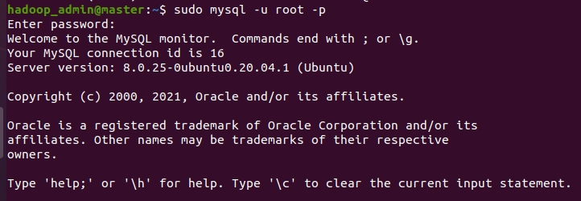
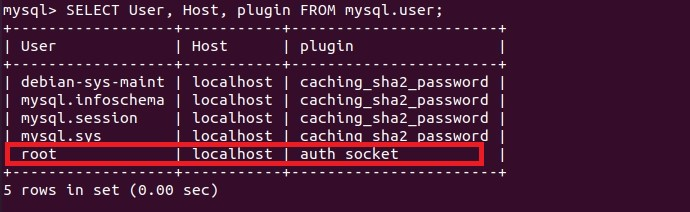
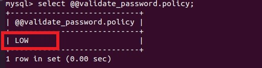
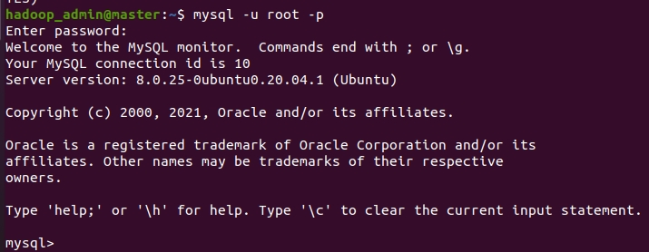

# Ubuntu 20.04 安裝 MySQL

<br>

---

<br>

記錄一下在 Ubuntu-20.04 上安裝 MySQL 外加安全設定的步驟。

<br>

```bash
sudo apt install mysql-server
```

<br>

安裝好後，執行以下命令設定密碼等設定：

<br>


```bash
sudo mysql_secure_installation
```

<br>
<br>
<br>
<br>

```bash
Securing the MySQL server deployment.

Connecting to MySQL using a blank password.

VALIDATE PASSWORD COMPONENT can be used to test passwords
and improve security. It checks the strength of password
and allows the users to set only those passwords which are
secure enough. Would you like to setup VALIDATE PASSWORD component?

Press y|Y for Yes, any other key for No: y
```

<br>

回答 `y`。

<br>


下面詢問密碼強度：


```bash
There are three levels of password validation policy:

LOW    Length >= 8
MEDIUM Length >= 8, numeric, mixed case, and special characters
STRONG Length >= 8, numeric, mixed case, special characters and dictionary                  file

Please enter 0 = LOW, 1 = MEDIUM and 2 = STRONG: 0
```

<br>

密碼強度我們先用 low 示範，這個後面是可以改的。輸入 `0`。

<br>
<br>

耀球設定一組 root 密碼：


```bash
Please set the password for root here.

New password: 

Re-enter new password: 

Estimated strength of the password: 50 
Do you wish to continue with the password provided?(Press y|Y for Yes, any other key for No) : y
```

<br>
<br>

移除 anonymous users：

```bash
By default, a MySQL installation has an anonymous user,
allowing anyone to log into MySQL without having to have
a user account created for them. This is intended only for
testing, and to make the installation go a bit smoother.
You should remove them before moving into a production
environment.

Remove anonymous users? (Press y|Y for Yes, any other key for No) : y
Success.
```

<br>
<br>

允許使用者遠端使用 root 帳密登入 (輸入 N) ：

```bash
Normally, root should only be allowed to connect from
'localhost'. This ensures that someone cannot guess at
the root password from the network.

Disallow root login remotely? (Press y|Y for Yes, any other key for No) : n
```

<br>
<br>

剩下的一路 `y` 就可以了：

<br>

```bash
Remove test database and access to it? (Press y|Y for Yes, any other key for No) : y
 - Dropping test database...
Success.

 - Removing privileges on test database...
Success.

Reloading the privilege tables will ensure that all changes
made so far will take effect immediately.

Reload privilege tables now? (Press y|Y for Yes, any other key for No) : y
Success.

All done! 
```

<br>
<br>
<br>
<br>

設定開機自動啟動 mysql：

<br>

```bash
sudo systemctl enable mysql.service
```

<br>

這時我們如果輸入：

```bash
mysql -u root -p
```

會發現無法登入，出現像這樣的錯誤：

<br>


<br>

這是因為 MySQL 在 Ubuntu 上預設使用 UNIX auth_socket plugin，這道制我們無法用非 root 系統帳號以外的帳號登入。

<br>

我們使用 sudo 就可以登入進去了：

```bash
sudo mysql -u root -p
```

<br>



<br>

成功進入後，使用以下指令檢查 user plugin：

<br>

```bash
mysql> SELECT User, Host, plugin FROM mysql.user;
```

<br>



<br>

我們使用以下幾組命令重設一下 mysql：

<br>

```bash
mysql> USE mysql;
mysql> UPDATE user SET plugin='mysql_native_password' WHERE User='root';
mysql> FLUSH PRIVILEGES;
mysql> ALTER USER 'root'@'localhost' IDENTIFIED WITH mysql_native_password BY 'your-new-password';
mysql> exit;
```

<br>
<br>

---

<br>

__Tips__:

如果你發現改新密碼的時候一直出現提示說密碼強度不合規範，那可能是 mysql 的 bug，在初始化設定時沒有確實的做好，我們可以手動更改密碼強度規範：

<br>

```sql
mysql> set global validate_password.policy=0;
```

<br>

查詢語法：

<br>

```sql
mysql> select @@validate_password.policy;
```

<br>



<br>

---

<br>

重啟 mysql：

<br>

```bash
sudo systemctl restart mysql.service
```

<br>

重新進入 mysql

<br>

```bash
mysql -u root -p
```

<br>



<br>

成功。

