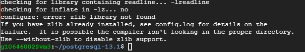
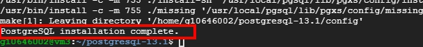

# Postgres 與 JDBC_FDW

<br>

---

<br>

## 簡介

<br>

市面上還是有一些資料庫是 Postgres FDW 無法支援到的，所以就有人開發了 JDBC_FDW 延伸套件。借助 JDBC 的通用性可以連線更多資料庫。

具個例子，如果我們想要使用 JDBC_FDW 來連線 sqlite 資料庫，可以像這樣建立外部伺服器：

<br>

```sql
CREATE EXTENSION jdbc_fdw;
```

```sql
CREATE SERVER jdbc_serv4 FOREIGN DATA WRAPPER jdbc_fdw OPTIONS(
    drivername 'org.sqlite.JDBC',
    url 'jdbc:sqlite:/home/abc/abc.sdb',
    querytimeout '15',
    jarfile '/home/abc/lib/sqlite-jdbc-3.7.2.jar',
    maxheapsize '600'
);
```

<br>

借助 JDBC 我們就可以實現與任何實作 JDBC 介面的 DB 介接，但是問題點就是部屬太麻煩了。這裡就寫一下部屬 JDBC_FDW 的筆記。

<br>
<br>

首先要先說明很重要的一點，那就是如果要使用 JDBC_FDW 那就不能使用 Linux 發行商所維護的安裝方式進行安裝，比如 `apt`，`pacman`，`yum`。我們必須下載 postgres 原始碼自行編譯，然後再編譯 JDBC_FDW 原始碼。步驟有點多，這邊會一步一步計錄下來，從一個乾淨的環境建立出 JDBC_FDW 環境。

<br>
<br>
<br>
<br>

## 實作

<br>

首先我們先下載 postgres 的 source code，下載網址在這邊：

<br>

[Postgres 原始碼下載](https://www.postgresql.org/ftp/source/)

<br>

當前日期是 2021/02/03，最新的穩定版本是 v13.1，所以就拿這一版做示範。下載 tar.gz 檔案：

<br>


<br>

把這個檔案放在當前 user 的 home 資料夾下：

<br>


<br>

接下來就是 unzip 這個壓縮檔了：

<br>

```bash
gunzip postgresql-13.1.tar.gz
```

```bash
tar xvf postgresql-13.1.tar
```

<br>

解壓縮之後得到完整 source code 如下：

<br>


<br>

接下來 cd 到 postgresql-13.1 source code 目錄，裡面會有一個 configure 文件。要先執行一下它：

<br>

```bash
./configure
```

顯然會出現一些錯誤，我們就要一個一個的解決 configure 告訴我們的錯誤，首先看到這個：

<br>


<br>

顯然是因為我們沒有安裝 gcc 與 make （編譯 C++ 使用的工具），所以我們就滿足它的要求安裝一下：

<br>

```bash
sudo apt-get update
sudo apt-get install gcc make
```

<br>

完成安裝後我們重新再執行一次 `./configure`，這次我們會看到不一樣的 error。

<br>


<br>

它說我們缺少 readline 套件，我們一樣滿足它：

<br>

```bash
sudo apt-get install libreadline-dev
```

<br>



<br>

它又說我們缺少 zlib 套件，我們還是要滿足它：

<br>

```bash
sudo apt-get install zlib1g-dev
```

<br>

再次執行一次 `./configure`，這一次應該就能成功執行了。不會再出現 error 的問題。

<br>

接下來我們執行 `make` 編譯 postgres。

<br>

```bash
make
```

<br>

這個編譯任務會執行蠻久的一段時間，耐心等待。看到以下回應代表編譯成功：

<br>


<br>

編譯成功了，那就開始安裝吧：

<br>

```bash
sudo make install
```

<br>



<br>

都沒問題就會顯示安裝成功。

<br>

接下來就是一連串的 postgtes 設定工作，跟著一行一行輸入就行了：

<br>

```bash
sudo adduser postgres

sudo mkdir /usr/local/pgsql/data

sudo chown postgres /usr/local/pgsql/data

su - postgres

/usr/local/pgsql/bin/initdb -D /usr/local/pgsql/data

/usr/local/pgsql/bin/pg_ctl -D /usr/local/pgsql/data -l logfile start
```

<br>

當最後一行指令執行完畢後，應該會看到如下回應：

<br>


<br>


