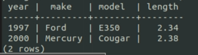

# Postgres 使用 Multicorn 的 CsvFdw

<br>

---

<br>

計錄 Postgres 的 multicorn_fdw 使用 CsvFdw 模組經驗。

<br>

在準備好 Postgres 的 multicorn extension 後，我們需要建立一個 CsvFdw Server。在 `psql` 中輸入以下指令：

<br>

```sql
CREATE SERVER csv_srv foreign data wrapper multicorn options (
    wrapper 'multicorn.csvfdw.CsvFdw'
);
```

<br>

有了這個 foreign server 我們就可以把本地端的 csv 檔案映射成 table 了。但在這之前，還需要準備一個 csv 檔案在本機上：

<br>

/tmp/test.csv

<br>

```csv
Year,Make,Model,Length
1997,Ford,E350,2.34
2000,Mercury,Cougar,2.38
```

<br>

回到 `psql`，我們直接建立 foreign table 試試看：

<br>

```sql
create foreign table csvtest (
       year numeric,
       make character varying,
       model character varying,
       length numeric
) server csv_srv options (
       filename '/tmp/test.csv',
       skip_header '1',
       delimiter ',');
```

<br>

注意這邊的 `skip_header`，代表說 csv 第一列跳過不被包括進資料內。`delimiter` 是 csv 分隔符號。

<br>

接下來對這個 table 進行 select 查詢：

<br>

```sql
select * from csvtest;
```

<br>



<br>

事實上，在 postgresql 中的所有 foreign table 都是可以做 inner join 查詢的。