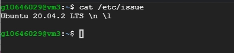
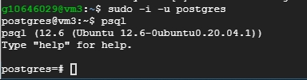
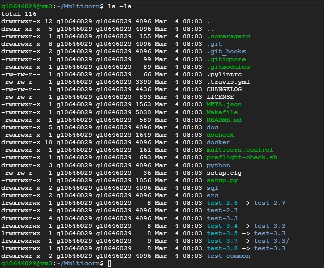
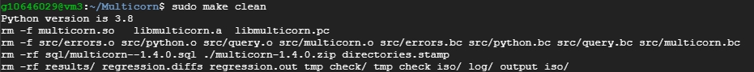
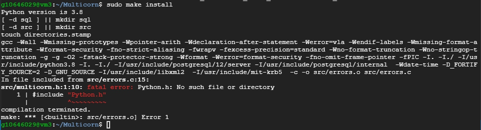
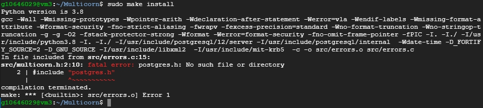
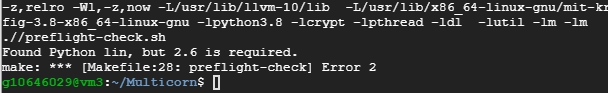
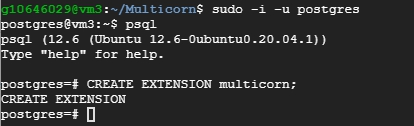

# Postgres 安裝 Multicorn

<br>

---

<br>

Multicorn 是 PostgreSQL 9.1+ 的擴展，旨在通過允許開發者使用 Python 語言來簡化 Foreign Data Wrapper 的開發。

<br>

以下將示範在 Ubuntu 20.04 的環境下安裝部屬 Multicorn。

<br>



<br>

首先環境中必須要有 postgres，如果沒有就自行安裝，至於安裝細節這邊就不細說了。總之要能成功使用 `psql` 進到指令交互介面。

<br>



<br>

我們使用 git 來 clone 下來 Multicorn 的 source code。

<br>

```bash
git clone git://github.com/Kozea/Multicorn.git
```

<br>

clone 下來 source code 之後，cd 進資料夾內，應該可以看到如下的資料內容：

<br>



<br>

在這之前，我們要先確保環境中有 `make` 與 `gcc` 套件，如果沒有的話就自行安裝。

<br>

```bash
sudo apt-get install make
sudo apt-get install gcc
```

<br>

先使用 `make clean`：

```bash
sudo make clean
```

<br>



<br>

然後使用 `make install` 編譯安裝：

<br>

```bash
sudo make install
```

<br>

也許你會看到這個錯誤訊息：

<br>



<br>

這是由於缺少 python 或者 python-dev 套件，所以直接 `apt-get install` 解決：

<br>

```bash
sudo apt-get install python3 python3-dev
```

<br>

重試一下 `make install` 可能會出現另一個錯誤訊息：

<br>



<br>

這是因為我們還沒有安裝 postgresql-server-dev 套件，在安裝套件前，要先檢查 postgres 的版本：

<br>

```bash
psql --version
```

<br>


<br>

我們的 postgres 版本是 12.* 版的，所以相對的 server-dev 套件也要一至，現在就下載吧：

<br>

```bash
sudo apt-get install postgresql-server-dev-12
```

<br>

接下來會遇到這個 error：

<br>



<br>

這邊要求我們安裝 python 2.6 以上，實際上使用 python3 是不行的如果只有 python3 的話也會失敗，所以我們就來手動安裝一下 python 2.+ 吧。

<br>

```bash
sudo apt-get install python2
```

<br>

然後再執行一次 `make install` 一次就可以完成了。

<br>

最後，回到 `psql` 指令交互介面讓我們實際建立 postgres_FDW 延伸：

<br>

```sql
CREATE EXTENSION multicorn;
```

<br>



