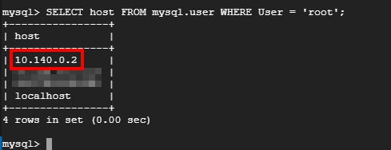
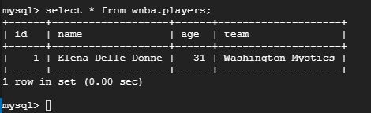
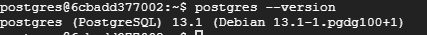
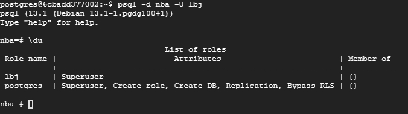
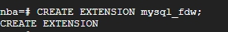
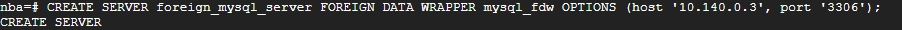
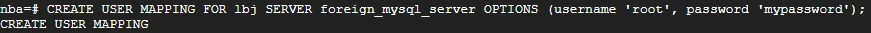
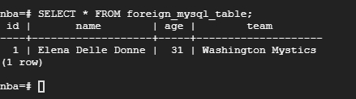

# Postgres FDW 存取 MySQL

<br>

---

<br>

承接前一個章節，我們成功部屬好了跨主機查詢關聯表。接下來再進階一點，我們來實現用 postgres 查詢 MySQL 資料庫。

承接上一個章節中，我們有 2 個 vm，如下：

<br>


<br>

vm1 中已經安裝好 postgres 了，現在我們要在 vm2 上安裝 mysql。安裝步驟就略過了，我們直接跳到配置 mysql 的步驟吧。

<br>

因為 mysql 預設只允許 localhost 連線。所以我們需要開放允許 vm1 那一端連線過來存取。我們可以如下設定：

<br>

允許 10.14.0.2（vm1） 使用 root 帳號連線 mysql，（`mypassword` 是我的 db 密碼）。

```sql
CREATE USER 'root'@'10.140.0.2' IDENTIFIED BY 'mypassword';
```

開放權限給 vm1：

```sql
GRANT ALL PRIVILEGES ON *.* TO 'root'@'10.140.0.2';
```

<br>

以上的動作都完成之後，來查詢驗證一下：

```sql
SELECT host FROM mysql.user WHERE User = 'root';
```



<br>

這張 table 表示，除了 localhost，還有 10.140.0.2（vm2）可以連線 mysql。

<br>

除此之外還需要開通 `mysql_native_password`：

```sql
ALTER USER 'root'@'10.140.0.2' IDENTIFIED WITH mysql_native_password BY 'mypassword';
```

<br>

接下來我們 create database 與一張 table 做測試使用。

<br>

```sql
CREATE DATABASE wnba;
```

```sql
CREATE TABLE wnba.players(id int, name varchar(32), age int, team varchar(32));
```

<br>

塞一些假資料進去：

```sql
INSERT INTO wnba.players (id, name, age, team) VALUES (1, 'Elena Delle Donne', 31, 'Washington Mystics');
```

<br>

查詢一下試試看：

```sql
SELECT * FROM wnba.players;
```



<br>
<br>

以上，我們 vm2 中的 mysql 就已經部屬好了。接下來開始 vm1 的準備工作。（沒看過上一個章節的要把上一個章節先看完）。

<br>

首先，postgres 預設是不會有 mysql_fdw 擴充功能的，我們要手動安裝，這裡我的示範使用 Ubuntu 20.04，先查詢 postgres 版本：

```bash
postgres --version
```



<br>
<br>

然後用 apt 安裝 mysql-fdw（版本要對應 13 版）

<br>

```bash
apt-get install postgresql-13-mysql-fdw
```

<br>

安裝好後我們就可以使用 postgres mysql_fdw extension 了。

<br>

我們先登入 postgres 控制台：

```bash
psql -d nba -U lbj
```

<br>



<br>
<br>
<br>
<br>

建立 mysql_fdw extension：


```sql
CREATE EXTENSION mysql_fdw;
```




<br>
<br>

建立外部伺服器，使用　vm1 IP 位址以及 mysql port 號：

```sql
CREATE SERVER foreign_mysql_server FOREIGN DATA WRAPPER mysql_fdw OPTIONS (host '10.140.0.3', port '3306');
```



<br>
<br>

建立使用者映射：

```sql
CREATE USER MAPPING FOR lbj SERVER foreign_mysql_server OPTIONS (username 'root', password 'mypassword');
```



<br>
<br>

建立外部資料表：

```sql
CREATE FOREIGN TABLE foreign_mysql_table (id int, name varchar(32), age int, team varchar(32)) SERVER foreign_mysql_server OPTIONS (dbname 'wnba', table_name 'players');
```


<br>
<br>

以上的設定都完成了，接下來就可以針對這張 table 做查詢動作了：

```sql
SELECT * FROM foreign_mysql_table;
```



<br>
<br>
