# Postgres FDW 使用範例

<br>

---

<br>

## 簡介

<br>

Postgres FDW 可以做甚麼？間單來說，假如我們有 2 個資料庫，這兩個資料庫可以是不同的產品（例如 postgres 與 mysql ）。我們想要跨主機跨 DB 做關聯查詢，就可以使用 postgres FDW。

postgres FDW 就好像是建立一個 mapping table 一樣，在 postgres 的 database 裡面建立一個 table，這個 table 要與目標一致。當完成 fdw 設定之後，我們對這個 table 下 sql 指令的時後，感覺就像是在 query 本地端的 postgres 資料表，事實上 postgres 會代理我們去 query 遠端的 db。

<br>

接下來就來做一個示範，建立兩台虛擬機 vm1 與 vm2，我們要在兩台機器中安裝 postgres，在 vm1 的 postgres 上對 vm2 中的作 fdw 映射。

<br>
<br>
<br>
<br>

## 環境布置

<br>

需要建置 2 個虛擬機，我這邊使用 GCP 來示範：

<br>

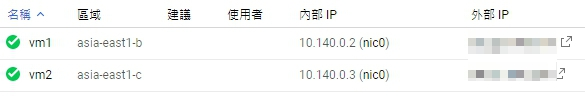

<br>

安裝 pg 的方式就不多作介紹了，我是使用 docker 安裝的，如果不使用 docker 也不影響。這邊我直接跳過 docker 安裝步驟，直接跳到 2 個虛擬機都準備好 postgres 的狀態。

<br>

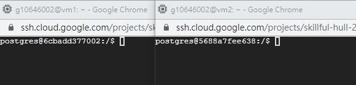

<br>

現在我們已經布置好 2 台虛擬機了，它們各自已經開始運行 postgres 服務了。切換到 postgres 帳號，輸入 `psql` 指令進入 postgres 控制台。 

<br>

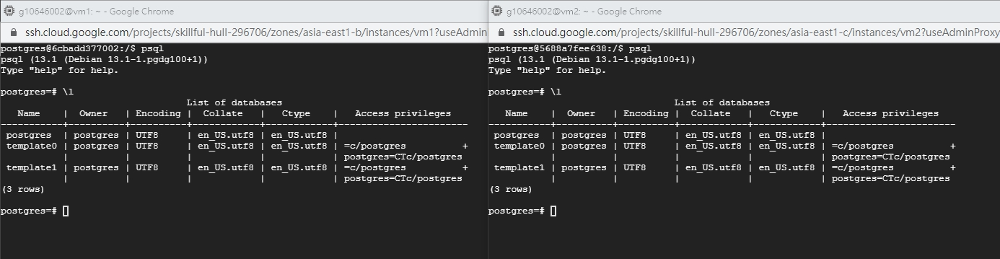

<br>

我們在 vm1 的 postgres 中建立一個 USER 叫做 lbj（LeBron James），vm2 的 postgres 中建立一個 USER 叫 gal（郭艾倫），密碼為了方便演示都是 `mypassword`。指令如下：

vm1：

```sql
CREATE USER lbj WITH PASSWORD 'mypassword';
```

vm1：

```sql
CREATE USER gal WITH PASSWORD 'mypassword';
```

<br>

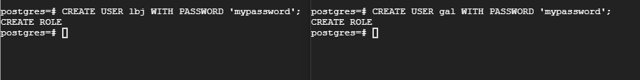

<br>
<br>

為了方便演示，我們把這兩個 USER 設定成 SUPERUSER：

<br>

vm1：

```sql
ALTER USER lbj WITH SUPERUSER;
```

vm2：

```sql
ALTER USER gal WITH SUPERUSER;
```

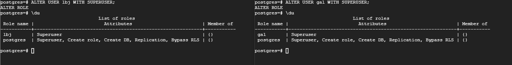

<br>
<br>

接下來分別建立資料庫，並且發放權限給 USER：

vm1：

```sql
create database NBA;
GRANT ALL PRIVILEGES ON DATABASE NBA TO lbj;
```

vm2：

```sql
create database CBA;
GRANT ALL PRIVILEGES ON DATABASE CBA TO gal;
```

<br>
<br>

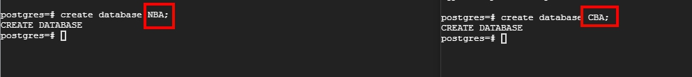

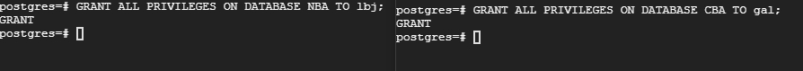

<br>
<br>

完成之後，我們離開 `psql` 控制台，重新帶 USER 與 DB 參數進入：

vm1：

```bash
psql -d nba -U lbj
```

vm2：

```bash
psql -d cba -U gal
```

<br>

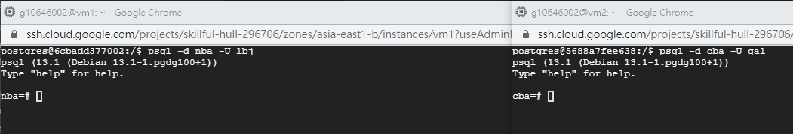

<br>
<br>
<br>

在兩個 database 中建立 table -> players：

<br>

vm1：
```sql
create table players(id int, name varchar(32), age int, team varchar(32));
```
vm2：
```sql
create table players(id int, name varchar(32), age int, team varchar(32));
```

<br>
<br>

在來塞一點假資料進去：

<br>

```sql
INSERT INTO players (id, name, age, team) VALUES (1, 'LeBron James', 36, 'lakers');
```
vm2：
```sql
INSERT INTO players (id, name, age, team) VALUES (1, '郭艾倫', 27, '遼寧隊');
```

<br>

使用查詢語法差看資料表中的 data：

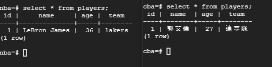

<br>

前置工作都做好了，現在正是開始布置 fdw。

<br>
<br>
<br>
<br>

## FDW

<br>

在 vm1 中安裝 fdw 延伸功能：

```sql
CREATE EXTENSION postgres_fdw;
```

<br>

然後使用 `CREATE SERVER` 建立一個外部伺服器，這個外部伺服器其實就是 vm2 的 postgres，所以我們需要知道 vm2 的 IP 位置以及 db port 號還有 db 名稱。

<br>

```sql
CREATE SERVER foreign_server FOREIGN DATA WRAPPER postgres_fdw OPTIONS (host '10.140.0.3', port '5432', dbname 'cba');
```

<br>

接下來要建立使用者對應關聯，如下：

<br>

```sql
CREATE USER MAPPING FOR lbj SERVER foreign_server OPTIONS (user 'gal', password 'mypassword');
```

<br>

最後就是建立映射 table 了：

```sql
CREATE FOREIGN TABLE foreign_table (id int, name varchar(32), age int, team varchar(32)) SERVER foreign_server OPTIONS (schema_name 'public', table_name 'players');
```

<br>

這樣就建立好了外部映射表，讓我們查看一下：

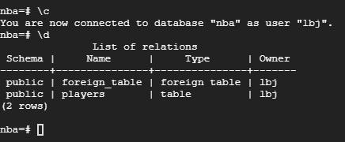

<br>

在我們 nba 的 database 中，已經有 2 張 table 了，一張是原本的 players，另一張 foreign_table 則是映射 vm2 中 postgres 的 cba.players 資料表。現在我們可以分別對 players 與 foreign_table 做 select 試看看：

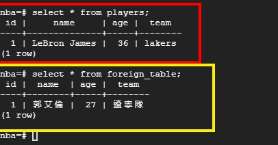

<br>

這些動作通通都是在 vm1 上完成的。試想一下，如果 foreign_table 是球員得分數據，我們就可以讓兩張表作各種 join 查詢。