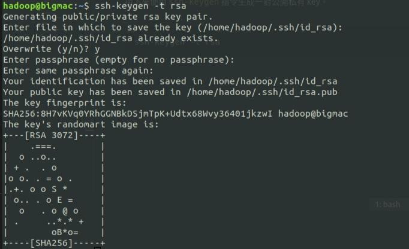

# Hadoop 基礎安裝教學

<br>

---

<br>

## 介紹

<br>

Hadoop 的 HDFS 儲存方式是以分散系統的方式實作，將檔案切割成多個小 block，並將這些小 block 分散儲存在 "DataNode" 中，然後由 "NameNode" 來集中管理檔案 block 的位置。

<br>

DataNode 是儲存資料的節點，NameNode 是紀錄這些檔案位置的節點，這兩個節點可以分別佈置在不同主機上同時也可以隨時擴充。

Hadoop 也可以設定 block 的備份，可以把 1 個 block 複製成多份並存放在不同的 DataNode 中。如果有一台 DataNode 損壞離線，也可以透過其他台 DataNode 的 block 備份還原資料。

<br>
<br>
<br>
<br>

## 安裝

<br>

系統版本 ： Ubuntu 20.04

<br>
<br>
<br>
<br>

### 一. JDK 安裝

<br>

首先先來安裝一下 jdk，這邊我們使用 1.8 版。

```bash
sudo apt update 
sudo apt install openjdk-8-jdk
```

<br>

安裝成功後使用 `java -version` 檢查一下 jvm 版本：


<br>
<br>
<br>
<br>

### 二. 建立 Hadoop User

<br>

建立使用者


```bash
sudo useradd hadoop 
```
<br>

除了 password 之外其他都不用填。結尾輸入 'y' 確認。

```bash
Adding user `hadoop' ...
Adding new group `hadoop' (1000) ...
Adding new user `hadoop' (1000) with group `hadoop' ...
Creating home directory `/home/hadoop' ...
Copying files from `/etc/skel' ...
New password:
Retype new password:
passwd: password updated successfully
Changing the user information for hadoop
Enter the new value, or press ENTER for the default
        Full Name []:
        Room Number []:
        Work Phone []:
        Home Phone []:
        Other []:
Is the information correct? [Y/n] y
```

<br>

為了方便之後的一些操作，這裡先將 hadoop 使用者加入到 sudo 群組：

<br>

```bash
sudo adduser hadoop sudo
```

<br>
<br>
<br>
<br>

### 三. 設定 SSH 免密碼登入

<br>

首先我們先切換到 hadoop 使用者帳號：

<br>

```bash
sudo su hadoop
```

<br>

接下來使用 `ssh-keygen` 指令生成一對公開私有 key。

<br>

```bash
ssh-keygen -t rsa
```

<br>

基本上一路按 enter 跟 `'y'` 就行了：

<br>



<br>
<br>

把生成好的 key 內容丟到 authorized_keys：


<br>

```bash
cat ~/.ssh/id_rsa.pub >> ~/.ssh/authorized_keys
```

<br>

更改檔案權限

<br>

```bash
chmod 640 ~/.ssh/authorized_keys 
```

<br>

接下來試試使用 ssh 登入 localhost：

<br>

```bash
ssh localhost
```

<br>


<br>

只要看到第一行的 `Welcome to Ubuntu` 就 OK 了。

<br>
<br>
<br>
<br>

### 四. 安裝 Hadoop

<br>

首先我們先下載 Hadoop-3.3.0 版本：

```bash
cd ~
wget https://downloads.apache.org/hadoop/common/hadoop-3.3.0/hadoop-3.3.0.tar.gz 
```

<br>

解壓縮 hadoop-3.3.0.tar.gz，並重新命名為 hadoop 放置於 `/usr/local`：

<br>

```bash
tar -xvzf hadoop-3.3.0.tar.gz 
mv hadoop-3.3.0 /usr/local/hadoop 
```

<br>

接下來要去設定一下環境變數。首先先來到 jdk 的安裝目錄 `/usr/lib/jvm`，在此目錄中我們可以找到 jdk1.8 的資料夾 `java-1.8.0-openjdk-amd64`，這邊把這個資料夾重新命名為 `java`：

<br>

```bash
mv java-1.8.0-openjdk-amd64 java
```

<br>

然後編輯 `~/.bashrc` 在文件結尾處添加內容如下：

<br>

```bash
# java config
export JAVA_HOME=/usr/lib/jvm/java
export JRE_HOME=${JAVA_HOME}/jre
export CLASSPATH=.:${JAVA_HOME}/lib:${JRE_HOME}/lib
export PATH=${JAVA_HOME}/bin:$PATH

# hadoop config
export HADOOP_HOME=/usr/local/hadoop
export HADOOP_INSTALL=$HADOOP_HOME
export HADOOP_MAPRED_HOME=$HADOOP_HOME
export HADOOP_COMMON_HOME=$HADOOP_HOME
export HADOOP_HDFS_HOME=$HADOOP_HOME
export HADOOP_YARN_HOME=$HADOOP_HOME
export CLASSPATH=$($HADOOP_HOME/bin/hadoop classpath):$CLASSPATH
export HADOOP_COMMON_LIB_NATIVE_DIR=$HADOOP_HOME/lib/native
export PATH=$PATH:$HADOOP_HOME/bin:$HADOOP_HOME/sbin
export HADOOP_OPTS="-Djava.library.path=$HADOOP_HOME/lib/native"
```

<br>

編輯好後不要忘記套用設定：

```bash
source ~/.bashrc
```

<br>

最後編輯 hadoop-env.sh 文件：

<br>

```bash
vim $HADOOP_HOME/etc/hadoop/hadoop-env.sh
```

<br>

編輯以下內容到文件尾部：

<br>

```bash
export JAVA_HOME=/usr/lib/jvm/java/
```

<br>
<br>
<br>
<br>

### 五. Hadoop 前置工作

<br>

首先需要建立 NameNode 與 DataNode 在 hadoop home 資料夾：

<br>

```bash
mkdir -p ~/hadoopdata/hdfs/namenode 
mkdir -p ~/hadoopdata/hdfs/datanode
```

<br>

接下來，編輯 core-site.xml 編輯內容如下（如果 configuration 有其他設定就一併刪除）：

<br>

```bash
vim $HADOOP_HOME/etc/hadoop/core-site.xml 
```

<br>

```xml
<configuration>
        <property>
             <name>fs.defaultFS</name>
             <value>hdfs://localhost:9000</value>
        </property>
</configuration>

```

<br>

然後換編輯 hdfs-site.xml ：

<br>

```bash
vim $HADOOP_HOME/etc/hadoop/hdfs-site.xml 
```

這裡就是設定檔案 block 的備份數量（replication）以及 NameNode DataNode 儲存位置。

<br>

```xml
<configuration>
 
    <property>
        <name>dfs.replication</name>
        <value>1</value>
    </property>
 
    <property>
        <name>dfs.name.dir</name>
        <value>file:///home/hadoop/hadoopdata/hdfs/namenode</value>
    </property>
 
    <property>
        <name>dfs.data.dir</name>
        <value>file:///home/hadoop/hadoopdata/hdfs/datanode</value>
    </property>

</configuration>
```

<br>

然後編輯 mapred-site.xml 文件：

<br>

```bash
vim $HADOOP_HOME/etc/hadoop/mapred-site.xml 
```

<br>

指定 MapReduce 框架，這裡使用 yarn（Yet Another Resource Negotiator）。

<br>

```xml
<configuration>
    <property>
        <name>mapreduce.framework.name</name>
        <value>yarn</value>
    </property>
</configuration>
```

<br>

最後編輯一下 yarn-site.xml：

<br>

```bash
vim $HADOOP_HOME/etc/hadoop/yarn-site.xml
```

<br>

```xml
<configuration>
    <property>
        <name>yarn.nodemanager.aux-services</name>
        <value>mapreduce_shuffle</value>
    </property>
</configuration>
```

<br>
<br>
<br>
<br>

### 六. 啟動 Hadoop Cluster

<br>

在啟動 Hadoop Cluster 之前，我們需要先 format 一下 NameNode，執行下面命令。

<br>

```bash
hdfs namenode -format 
```

<br>

執行成功後會看到以下回應

<br>


<br>

重點就是下面這一段：

```bash
/************************************************************
SHUTDOWN_MSG: Shutting down NameNode at bigmac/192.168.27.47
************************************************************/
```

<br>

格式化 namenode 之後就可以直接執行以下命令啟動 Hadoop Cluster：

<br>

```bash
start-dfs.sh
```

執行成功會看到如下回應：


<br>

啟動 Yarn 服務，指令如下：

<br>

```bash
start-yarn.sh
```


<br>

最後使用 `jps` 查看一下正在運行於 jvm 中的程式：

<br>


<br>
<br>
<br>
<br>

### 七. 調整防火牆

<br>

Hadoop 會開啟 `9870` port（NameNode web 資料） `8088` port（Cluster web 資料）

<br>

執行以下命令開啟防火牆放行 port：

<br>

```bash
firewall-cmd --permanent --add-port=9870/tcp 
firewall-cmd --permanent --add-port=8088/tcp 
```

<br>

reload 防火牆

<br>

```bash
firewall-cmd --reload 
```

<br>
<br>
<br>
<br>

### 八. 訪問 Hadoop NameNode 與 Resource Manager

<br>

訪問 NameNode Manager： http://localhost:9870

<br>


<br>
<br>

訪問 Resource Manager： http://localhost:8088

<br>
<br>


<br>
<br>
<br>
<br>

### 九. 實際測試 Hadoop Cluster

<br>

在 HDFS 中建立一個 logs 資料夾：

<br>

```bash
hdfs dfs -mkdir /logs 
```

<br>

驗證 logs 資料夾使是否被建立：

<br>

```bash
hdfs dfs -ls / 
```

<br>


<br>

同時我們訪問 NameNode Manager 一樣也可以看到這個目錄：

<br>


<br>

接下來我們把 `/var/log/` 目錄下的所有資料搬移到 hdfs 的 logs 目錄。

<br>

```bash
hdfs dfs -put /var/log/* /logs/ 
```

<br>

點進來 logs 看看內容：

<br>


<br>
<br>
<br>
<br>

如果要停止 Cluster 輸入以下 2 段命令：

```bash
stop-dfs.sh
```

<br>

```bash
stop-yarn.sh
```