# 整從建構 CI/CD 到設定 DNS 與 Domain 申請（gitab-cicd, GCP）

<br>

---

<br>

本篇筆記將帶領從 0 開始建構 CI/CD，部署到 GCP 並註冊靜態 IP，還有註冊 DNS 服務以及使用ㄋ Doamin Cloud 服務。

<br>

先交代一下，目前手上需要有的資源：

1. 一台 GCP 的虛擬機
2. 一包 Spring Boot 專案
3. 一個 Gitlab 帳號

首先要把 Spring Boot 專案推上 Gitlab

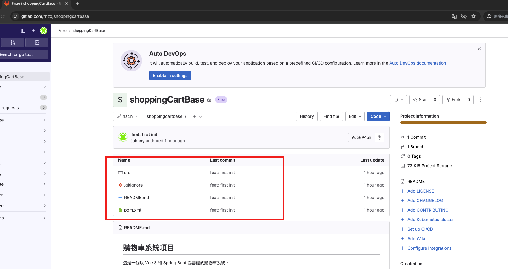

<br>

然後在 GCP 上建立一個執行個體（我這邊是使用 Ubuntu 鏡像)

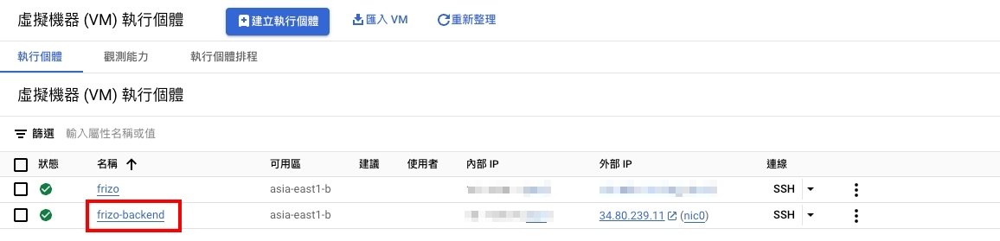

<br>
<br>
<br>
<br>

以上基本設施都準備完畢，接下來將進行幾個步驟

1. 創建 Gitlab CI/CD Runner 並註冊到 Gitlab 專案中。

2. 建構專案中的 pipline (gitlab-cicd.yml)。

3. 申請靜態 IP。

4. 調整 VPC 網路防火牆設定。

4. 使用 Cloud Domains 服務註冊一個 Domain。

5. 使用 Cloud DNS 服務登記靜態 IP 與 Domain。


<br>
<br>
<br>
<br>

---

<br>
<br>
<br>
<br>

## 1. 創建 Gitlab CI/CD Runner 並註冊到 Gitlab 中

<br>

Gitlab CI/CD 的核心就是 gitlab-runner，他是實際 CI/CD 計畫的執行者。一般來說，這個 Runner 會架設在一台伺服器上（如果只是想測試玩看看，也可以架在自己的 PC 上），然後這個 Runner 會註冊到你的 Gitlab 專案上，一旦發生一些觸發 pipline 的操作，gitlab 就會把 pipline 流程交給架設在伺服器（or 你的 PC） 上的 gitlab-runner 執行。

<br>

以下是 runner 跟 gitlab 之間交互的關係示意圖：

<br>

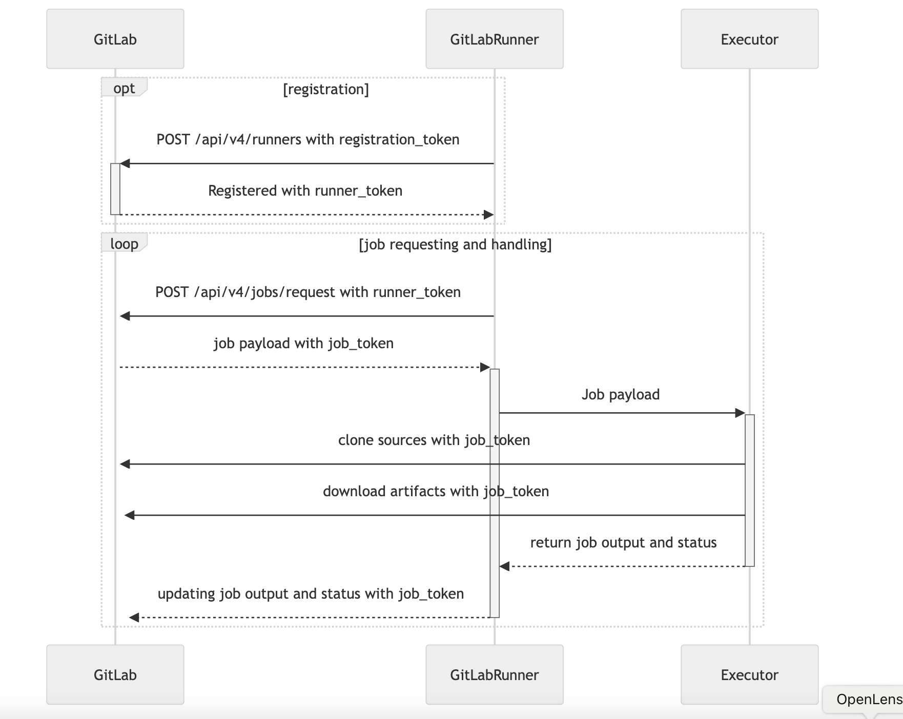

間單解釋一下， user 註冊一個 Runner, 使用 registration_token，向 gitlab 發一個 POST 請求，爾後 Gitlab 返回註冊成功，且 Runner 需要攜帶 runner_token 作為後續通訊憑證。

然後 Runner 會持續不斷使用 runner_token 向 Gitlab 發送請求，檢查是否有 pipline 需要執行。如果有，Gitlab 會返回任務的 payload 與 job_token，這些資料會向下傳遞到 Runner 的 Executor 中，Executor 會使用這個 job_token 下載 source_code，artifacts，pipline 腳本。最後把作業執行狀態回報給 Runner，Runner 攜帶 job_token 通知 Gitlab 更新作業狀態。

<br>

__以上流程理解不了不要緊，本篇筆記為十座導向，完成後回來再看一次，你也許就看得懂了。__

<br>
<br>

### 實作

<br>

首先使用 SSH 連線到是先建立好的 GCP VM 中。接下來要進行 docker 安裝，我們 Runner 採用 dokcer 部署的方式做，這樣比較簡單方便。docker 安裝這邊不多贅述，提供網址可以自行參考操作。照 docker 官網複製貼上操作就行。

[Install Docker Engine on Ubuntu](https://docs.docker.com/engine/install/ubuntu/)

<br>

安裝好 docker 後，下載 gitlab-runner 鏡像：

```bash
sudo docker pull gitlab/gitlab-runner
```

<br>

再來就是註冊 runner 到 gitlab 中。

開啟 gitlab 專案頁面的 CI/CD Runner 設定：

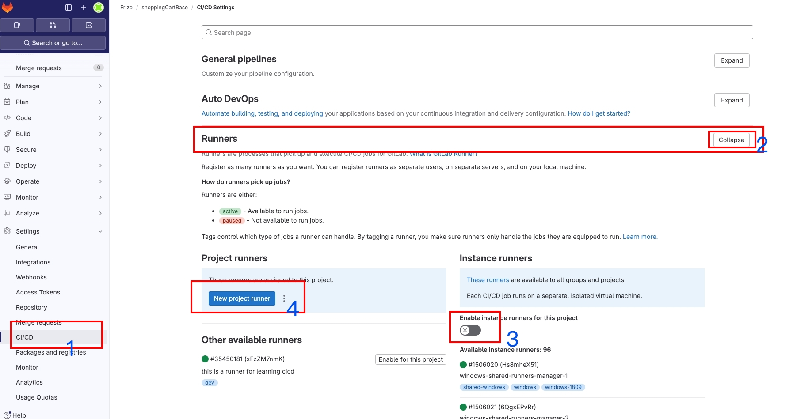

關閉 Instance runners （Gitlab 官方提供的免費 Runner），然後 New project runner。

<br>

內容設定如下：

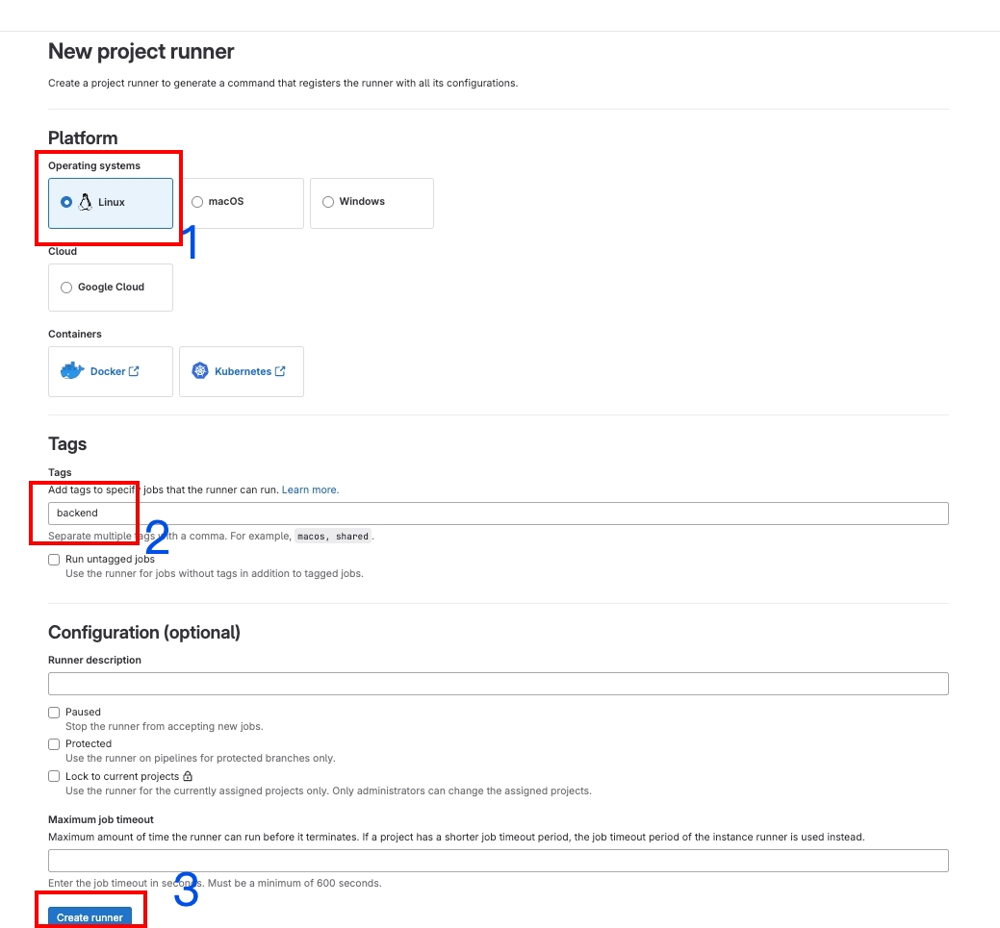

<br>

第二步驟的新增 tag，你可以理解為給這個 Runner 建立的名字，未來設定 pipline 時，每一個 job 都需要指定一個 Runner 來執行，就是透過 tag 來實現。例如我要執行部屬，就可以指定 tag 為 `backend` 的 Runner 來執行。

<br>

創建完成後，可以看到有 2 個關鍵資訊是我們需要的：

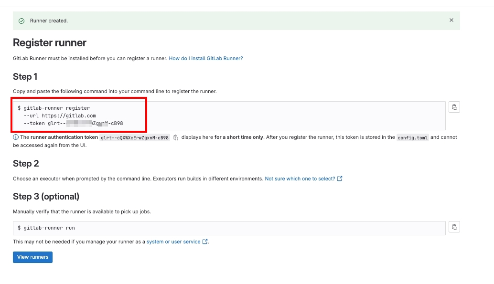


url 與 token 是我們需要的（這個 token 就是 `registration-token`）。

<br>

現在回到 GCP VM 中，執行 runner 註冊。指令如下：

```bash
sudo docker run --rm -v /srv/gitlab-runner/config:/etc/gitlab-runner gitlab/gitlab-runner register --non-interactive --url "https://************" --registration-token "glrt-***********-cB98" --executor docker --docker-image alpine:latest --description "docker-runner" --tag-list "backend" --run-untagged="true" --locked="false"
```

指令中需要替換的部分為 url 與 registration-token 參數，可以先複製到 txt 裡面先整理參數，再貼到 VM 中執行。

執行上面指令，會進入名為 gitlab-runner 的容器，執行 `register` 命令，並攜帶一些參數。
下面介紹一下這次註冊都做了什麼：

* `--rm` : 由於我們只是註冊，利用 Runner 鏡像寫設定資料並訪問一次 Gitlab，這是一個短運行容器指令，`--rm` 代表推出時自動清理容器內部文件。

* `-v`: 掛載目錄，容器目錄`/etc/gitlab-runner` 掛載到 VM 目錄`/srv/gitlab-runner/config`。這樣一來可以使 Runner 設定持久化，重啟或刪除也不受影響。容器的資料會持久化到本地。

* `--executor docker`: 指定 Executor 為 docker，pipline 真正的執行環境。

* `--url`: gitlab 網址，這裡替換成上面 New project runner 得到的網址。 

* `--registration-token`: 設定註冊 token，這裡替換成上面 New project runner 得到的 token。

* `--tag-list "backend"`: 指定 Runner 標籤，可以多個，用逗號分隔。（不要與其他 runner 標籤重複）

* `--non-interactive`: 表示每個註冊的 Runner 都是獨立的。不互相影響。

* `--docker-image alpine:latest`: 預設 pipline 鏡像，如果 pipline 李沒指定，預設就用這個當基底。

<br>

註冊好後，啟動 Runner 容器:

```bash
sudo docker run -d --name gitlab-runner --restart always -v /srv/gitlab-runner/config:/etc/gitlab-runner -v /var/run/docker.sock:/var/run/docker.sock gitlab/gitlab-runner:latest
```

以上步驟都操作無誤後，回到專案 Runner 看一下 Project runners:

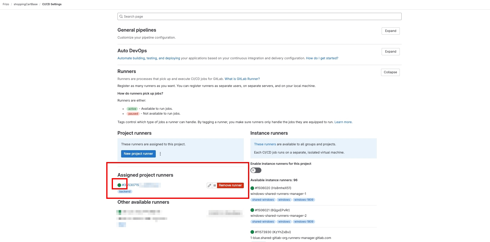

<br>

可以看到這個 runner 已經亮綠燈了，代表他隨時準備工作。

<br>
<br>

以上，Gitlab Runner 配置完畢。

<br>
<br>
<br>
<br>

---

<br>
<br>
<br>
<br>

## 2. 建構專案中的 pipline (gitlab-cicd.yml)

<br>

首先先在本機建構一個 Dockerfile。

```dockerfile
FROM ibm-semeru-runtimes:open-17-jdk-focal

ARG JAR_FILE_PATH

COPY ${JAR_FILE_PATH} app.jar

EXPOSE 8080

ENTRYPOINT ["java", "-jar", "app.jar"]
```

<br>

先嘗試一下建構跟執行，要先保證在 local 端測試通過。


<br>

建構鏡像：

```bash
docker build --build-arg JAR_FILE_PATH=target/shoppingCartBase-1.0-SNAPSHOT.jar -t shopping-cart-base .
```

`JAR_FILE_PATH` 參數會在 Dockerfile 中被替代。

<br>

建立容器：

```bash
docker run -d -p 8080:8080 --name scb shopping-cart-base
```

<br>

以上都沒問題的話，在本地端訪問 8080 服務應該要保證沒問題：


<br>
<br>

Dockerfile 步驟沒問題的話，接下來將進行下一步。

在這一步驟中，我們將逐步建立 install, test, build package, deploy 等 5 個 CI/CD 個步驟。並僅限於 `main` 這個 branch 有更新才進行 CI/CD。

<br>

在 Gitlab 上的專案上建立 pipline

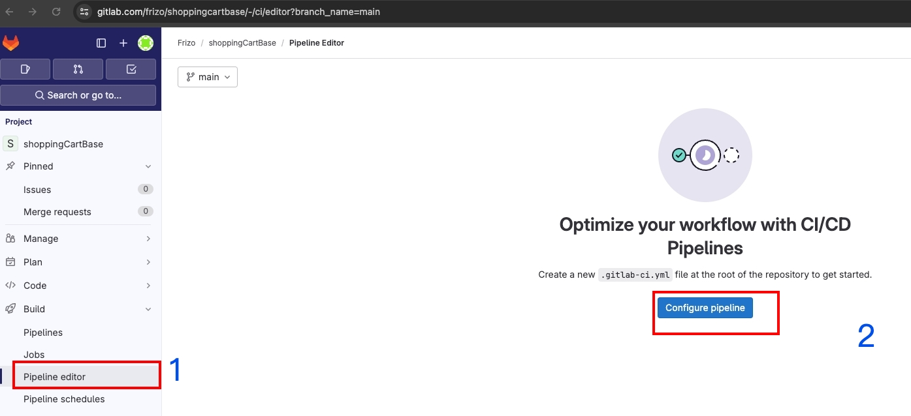

輸入以下內容：


```yml
stages:
  - install # 1. 安裝依賴步驟
  - test # 2. 單元測試
  - package # 3. 打包 Jar 檔
  - deploy # 4. 建構 Docker 鏡像與執行容器


.base-job-config: # 基底 job 可提供所有 job 繼承使用
    only:
        - main # 僅限 main 分支才做
    image: maven:3-jdk-11 # 各 job 基底 image
    tags:
      - backend
    before_script:
        - ls
    cache:
      key:
          files:
            - pom.xml
          prefix: service
      paths:
        - .m2
    interruptible: true # 如果有新的流水線產生，馬上中斷

##############################
#  以下定義 pipline 具體細節
##############################

# install
install-job:
    stage: install
    extends: [.base-job-config] # 繼承 .base-job-config
    script:
        - mvn install

# test
test-job:
    stage: test
    extends: [.base-job-config]    
    script:
        - mvn test
    cache:
      policy: pull #  cache should be pulled from the cache storage before the job starts.

# package
package-job:
    stage: package
    extends: [.base-job-config] 
    script:
        - mvn clean package -Dmaven.test.skip=true # clean and skip test
    artifacts:
      paths:
        - "target/*.jar" # build artifacts
    cache:
      policy: pull #  cache should be pulled from the cache storage before the job starts.

# depoly
depoly-job:
    stage: deploy
    extends: [.base-job-config]
    cache: [] # no need cache, it turn to artifacts
    variables:
      IMAGE_NAME: shopping-cart-base # 設定鏡像名稱變數
      APP_CONTAINER_NAME: scb # 設定容器名稱變數
      JAR_PATH: aa
    image: docker # 基底改用 docker
    script: # 
        - docker build --build-arg JAR_FILE_PATH=target/shoppingCartBase-1.0-SNAPSHOT.jar -t $IMAGE_NAME .    # 建構鏡像
        - if [ "$(docker ps -aq --filter name=$APP_CONTAINER_NAME)" ]; then docker rm -f $APP_CONTAINER_NAME; fi # 刪除舊的容器
        - docker run -d -p 8080:8080 --name $APP_CONTAINER_NAME $IMAGE_NAME # 建立新容器並執行
```

<br>

編輯好就提交，隨後查看流水線（等他跑完後），應該會看到這樣）：

<br>


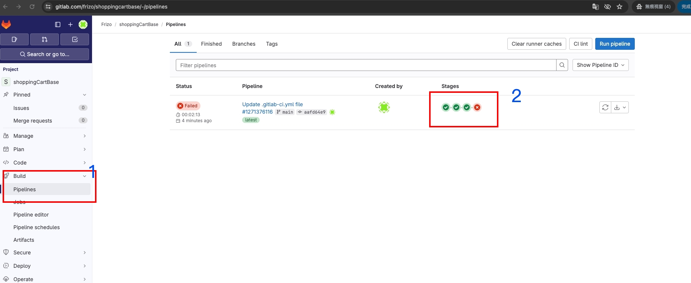

<br>

deploy 步驟之敗了，點進去查看 log 究竟發生了啥？

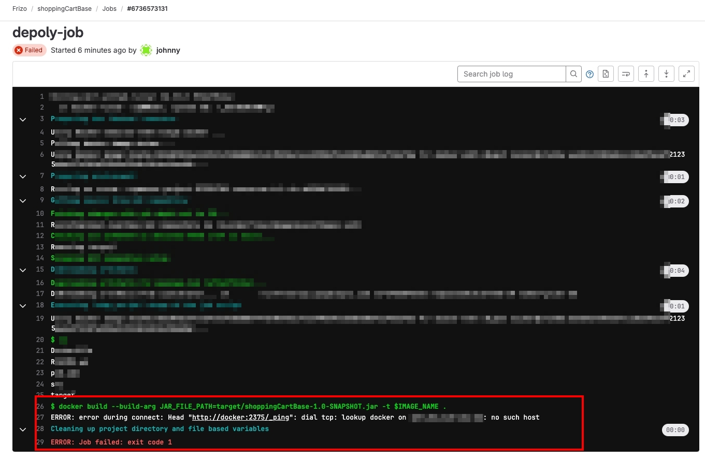

<br>

這個問題是由於 executor 執行的 `docker build` 是在 docker 容器內執行的，並不能銜接到 Docker darmon, 要解決這個問題。__只需要在 Gitlab Runner 的配置文件中找到使用的 Runner 並將 Docker 的目錄 /var/run/docker.sock 掛載到容器中就行。__

步驟如下：

1. 使用 SSH 進入 GCP VM。
2. 執行 `sudo vim /srv/gitlab-runner/config/config.toml`。
3. 找到 runner 配置部分，在 volumes 加入 `"/var/run/docker.sock:/var/run/docker.sock"`。

    ```vim
    concurrent = 1
    check_interval = 0
    shutdown_timeout = 0

    [session_server]
    session_timeout = 1800

    [[runners]]
    name = "docker-runner"
    url = "https://gitlab.com"
    id = 35530715
    token = "glrt--cQXWXcErwZgxnM-cB98"
    token_obtained_at = 2024-04-29T06:38:37Z
    token_expires_at = 0001-01-01T00:00:00Z
    executor = "docker"
    [runners.custom_build_dir]
    [runners.cache]
        MaxUploadedArchiveSize = 0
        [runners.cache.s3]
        [runners.cache.gcs]
        [runners.cache.azure]
    [runners.docker]
        tls_verify = false
        image = "alpine:latest"
        privileged = false
        disable_entrypoint_overwrite = false
        oom_kill_disable = false
        disable_cache = false
        volumes = ["/cache", "/var/run/docker.sock:/var/run/docker.sock"] # 加在這裡喔
        shm_size = 0
        network_mtu = 0
    ```

4. 重啟 gitlab-runner docker container。

    ```bash
    sudo docker restart gitlab-runner
    ```

<br>
<br>

設定好後，重新 run 一次失敗的 Job，這次應該就會成功了：

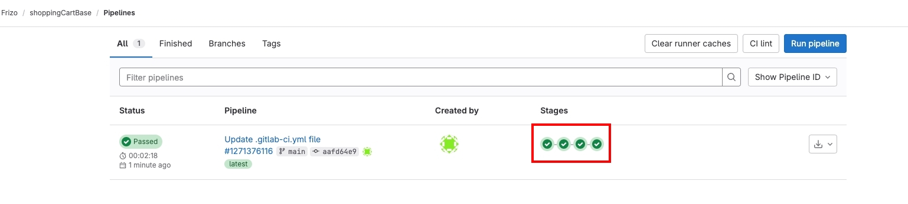


<br>

在 GCP VM 中執行 `sudo docker ps`

```bash
CONTAINER ID   IMAGE                         COMMAND                  CREATED         STATUS         PORTS                                       NAMES
968c7788b202   shopping-cart-base            "java -jar app.jar"      2 minutes ago   Up 2 minutes   0.0.0.0:8080->8080/tcp, :::8080->8080/tcp   scb
dff891769931   gitlab/gitlab-runner:latest   "/usr/bin/dumb-init …"   3 hours ago     Up 3 minutes                                               gitlab-runner
```

可以看到，我們的專案已經成功架設好了。

<br>
<br>

---

<br>
<br>

## 3. 申請靜態 IP

<br>

為我們的 VM 申請一組靜態 IP，這樣服務重啟後 IP 也不會變，也是為了後面註冊 DNS 做準備。

進到虛擬私有雲網路設定：

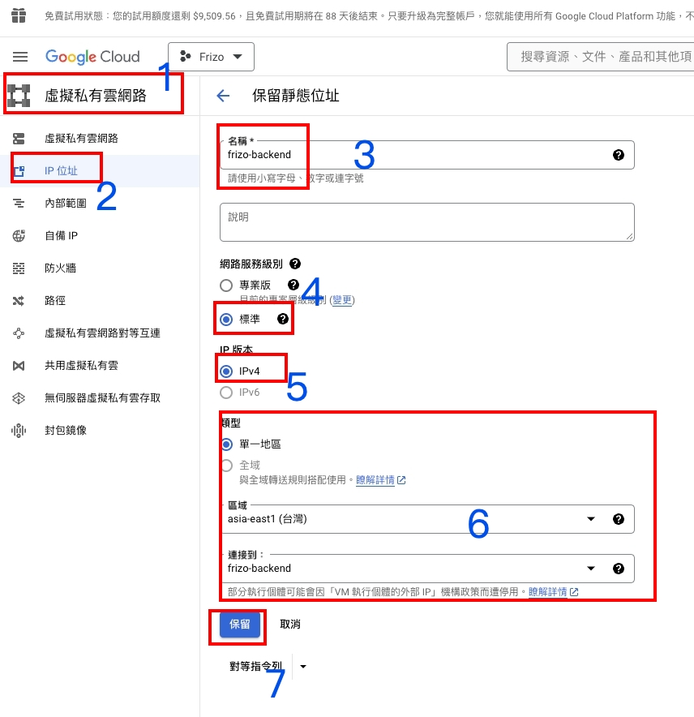

<br>

按下保留後，我們就得到一組靜態 IP 了，他已經綁定到該 VM（使用者）
 上。

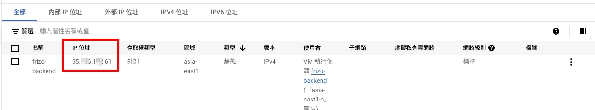

<br>
<br>
<br>
<br>

---

<br>
<br>
<br>
<br>

## 4. 調整 VPC 網路防火牆設定

<br>

這一步將開啟防火牆，放行外部的 8080 port 請求打進到 VM 裡面來。

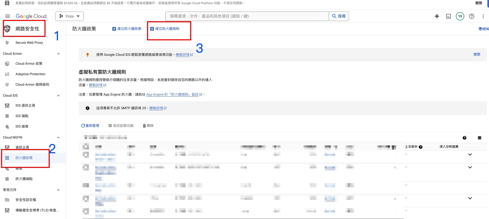


<br>

設定並建立防火牆規則（來源 IP 位置設定為 `0.0.0.0/0` 代表允許全部）：

<br>

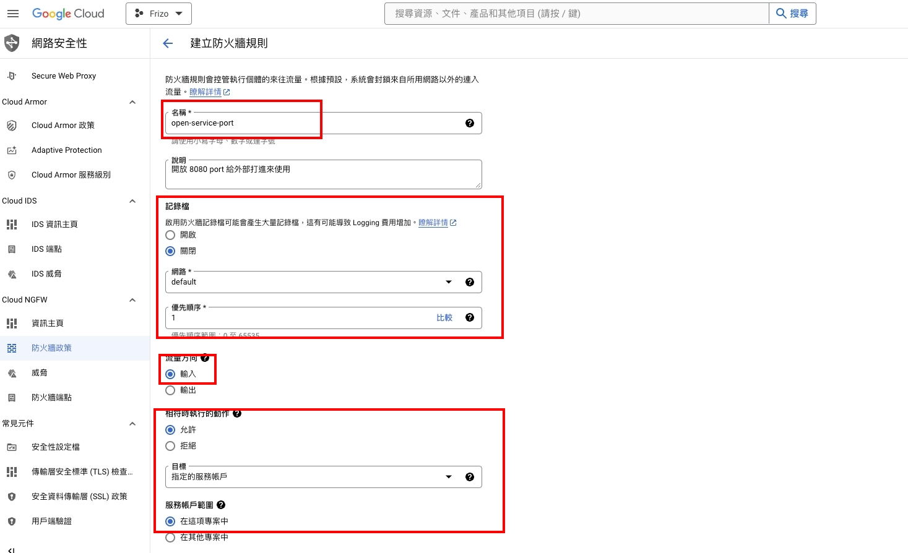

<br>

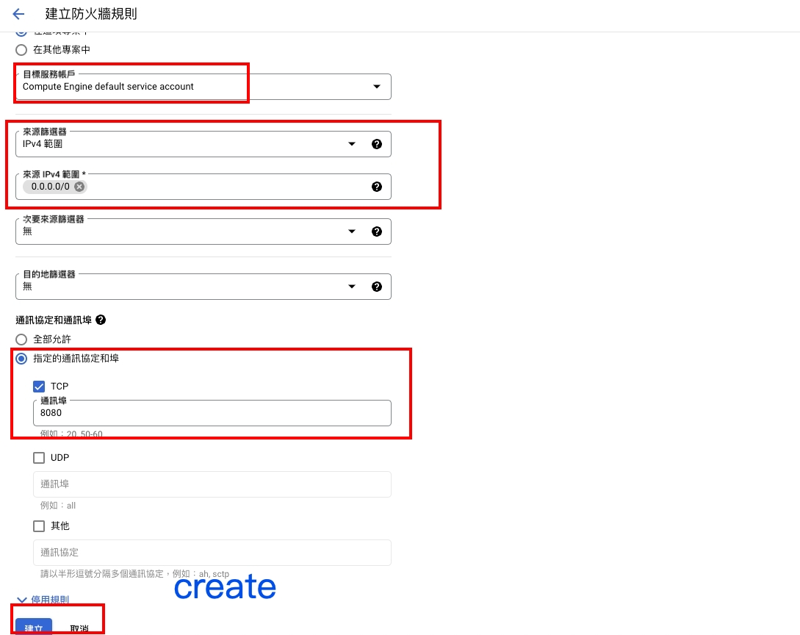

<br>

以上都設定好了好，就可以直接從外網打進去 VM 試試看了：

__這裡要小心，不要打到 https 去，我們並沒有設定 SSL。__ 用 http://... 就可以。

<br>

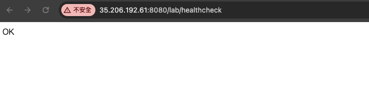


<br>
<br>
<br>
<br>

---


<br>
<br>
<br>
<br>


## 4. 使用 Cloud Domains 服務註冊一個 Domain

<br>

註冊域名，費用大概一年約 12 美金左右。

<br>

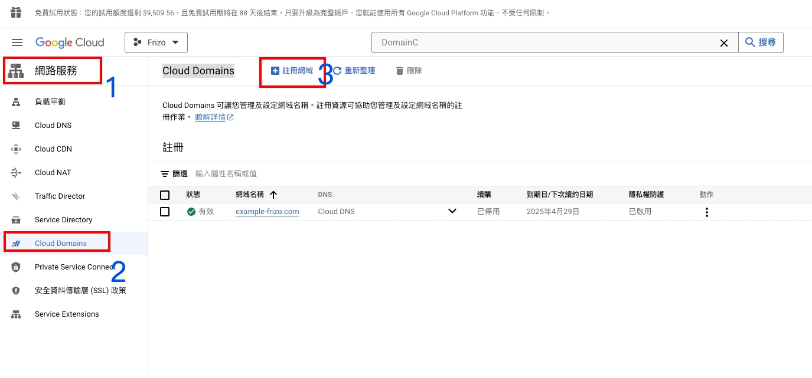


設定資料：

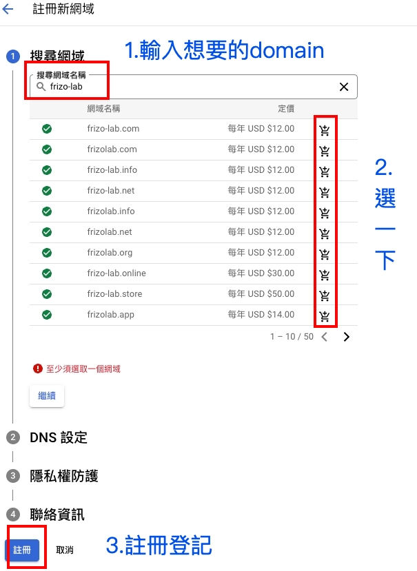

後面會要求設定聯絡資料名稱，國家電話，地址等等，這邊就不一一贅述了。

都填好後按註冊。

__註冊完成後記得去填入的郵箱中驗證郵箱，不然 15 天候 Domain 作廢。__

<br>
<br>
<br>
<br>

---

<br>
<br>
<br>
<br>

## 5. 使用 Cloud DNS 服務登記靜態 IP 與 Domain

<br>

來到 Cloud DNS 服務，建立可用區，綁定 VM 的 靜態 IP 與 剛剛註冊好的 Domain

<br>

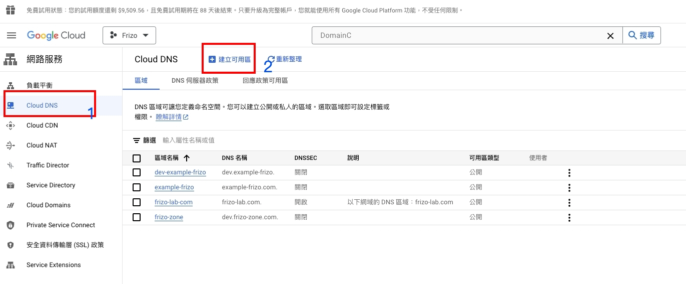

<br>

把值填上去

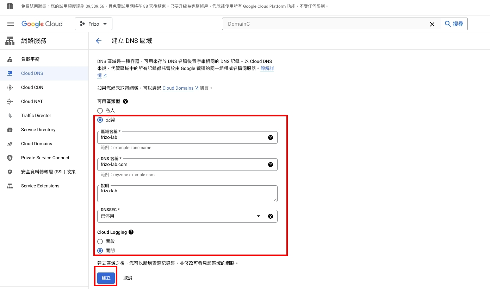


<br>

之後會來到 區域詳細資料 頁面，我們需要新增兩個標準：

<br>

建立第一個標準：

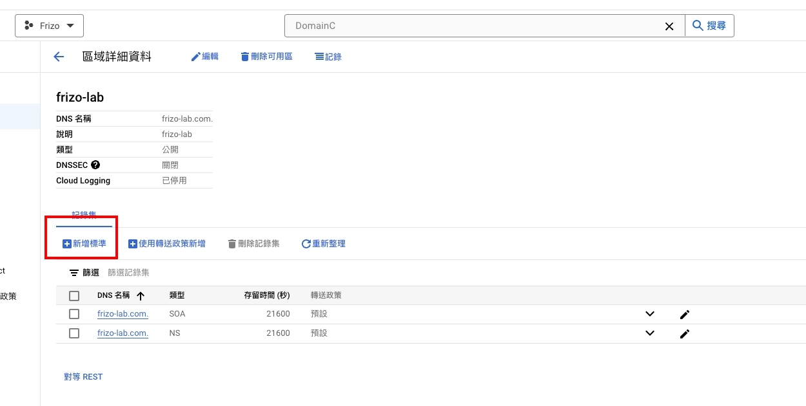

* 資料記錄類型選擇：__A__
* IPv4 位址選我們建立好的靜態 IP 位置。
* 建立

<br>
<br>


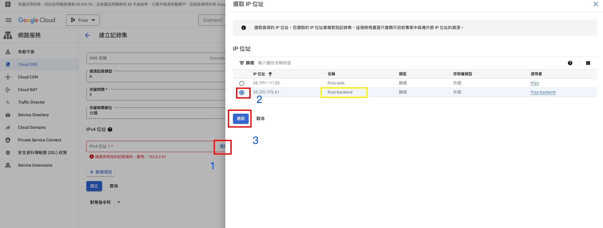

<br>
<br>

建立第二個標準 :

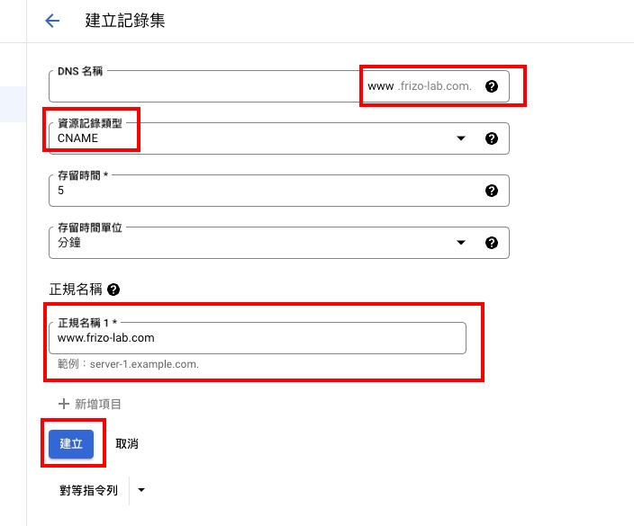

* 資源紀錄類型選:__CNAME__
* DNS 名稱加上 www
* 正規名稱打完整 Domain
* 建立

<br>

把原本用靜態 IP 訪問 /healthchech 改用 Domain 試試：

http://frizo-lab.com:8080/lab/healthcheck

<br>

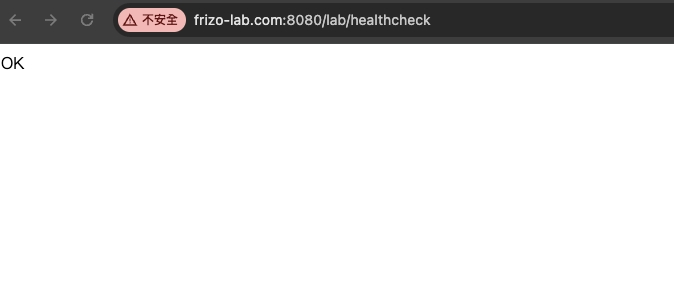

<br>
<br>
<br>
<br>


---

<br>
<br>
<br>
<br>

以上大功告成 !
