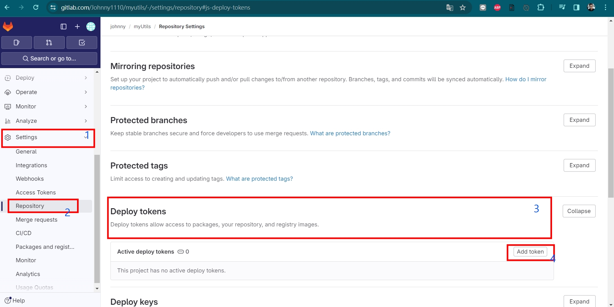
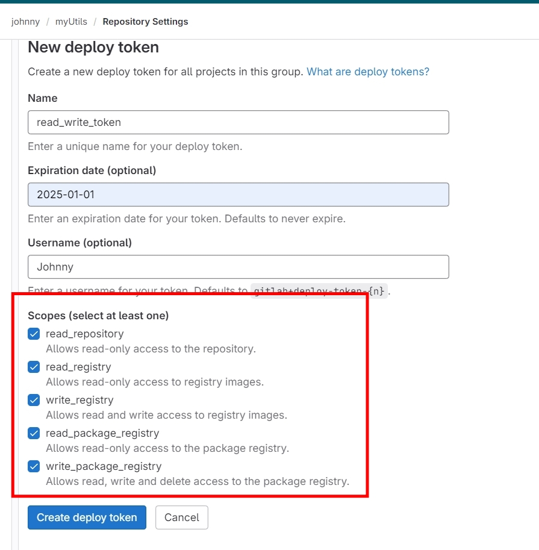
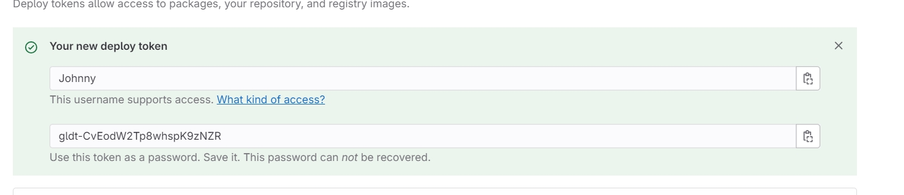
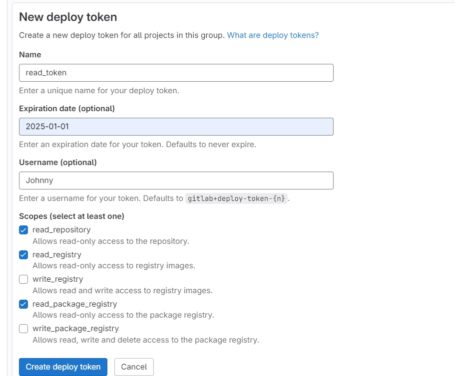
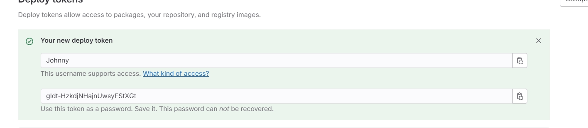
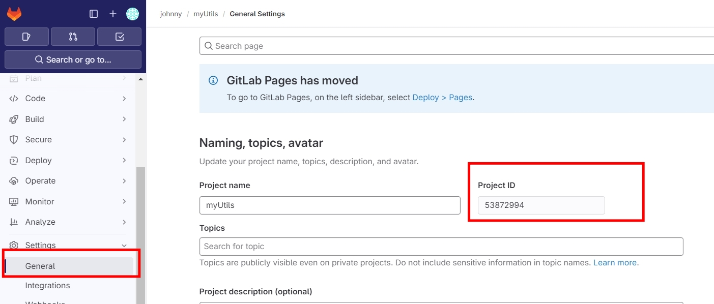
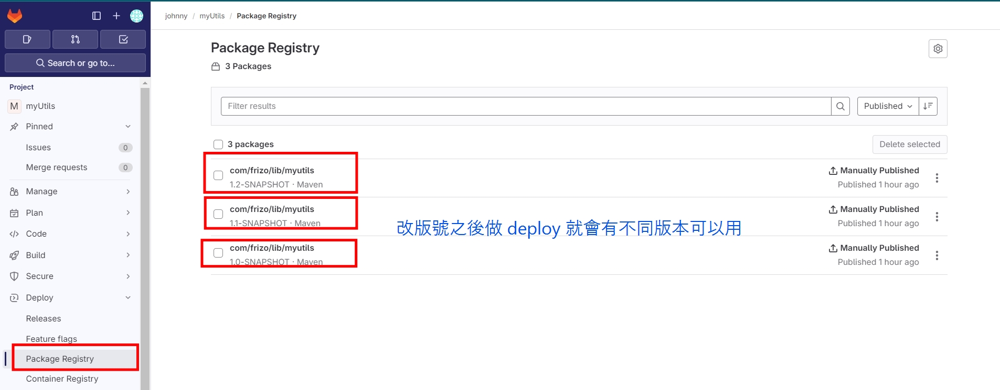
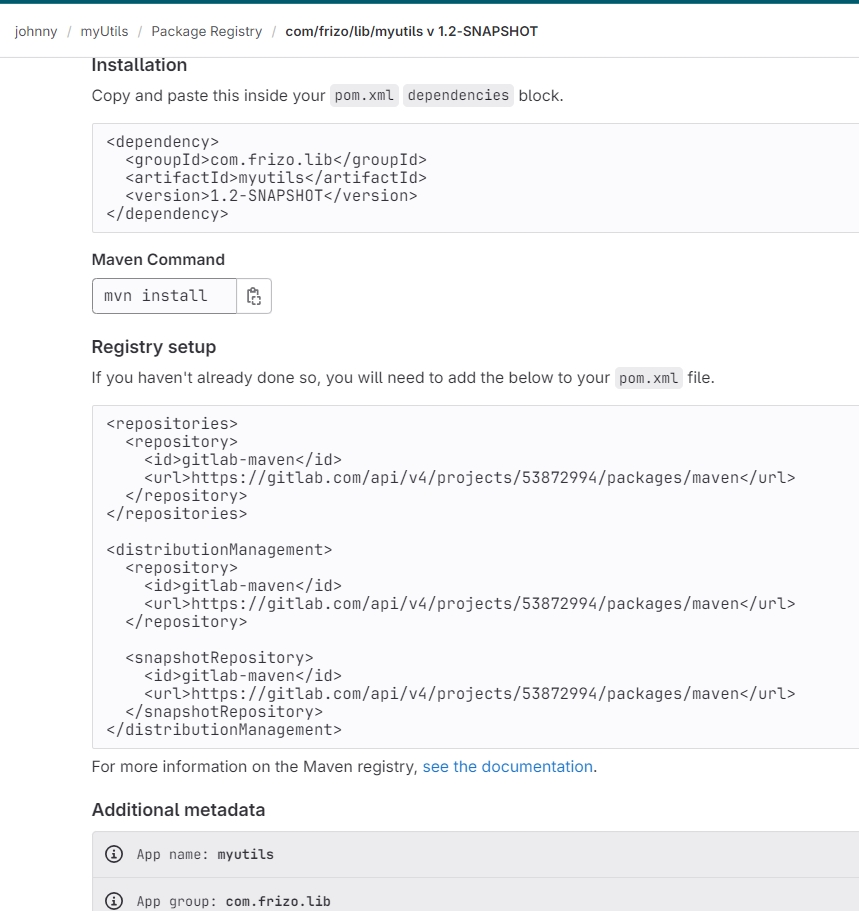

# 使用 gitlab 搭建 maven 倉庫 (Maven packages in the package registry)

<br>

---

<br>

參考文件:

https://docs.gitlab.com/ee/user/packages/maven_repository

<br>

如題，這篇筆記紀錄如何使用 gitlab 搭建 maven 私有倉庫。

開始前需要建立一個 gitlab 的 maven 專案，這裡就不展示如何建立專案了，直接開始。

<br>
<br>


<br>
<br>

## 1. 申請 Depoly Token

<br>

首先需要登入 gitlab，對需要做私有倉庫的專案申請 2 組 depoly token，先說明這兩組帳號用途:

token-1: 具有 __讀寫__ 權限的 read_write_token (給套件開發者用)

token-2: 具有 __讀__ 權限的 read_token (給套件使用者用)

按照以下步驟點 <button>Add token </button> 新增 TOKEN



<br>
<br>
<br>
<br>

先新增一個 read_write_token 給套件開發者用 :



__scope 全開__，name 可以隨便取。

建立好後會出現 access_token，這個 token 只會顯示一次，所以要記下來:



<br>
<br>
<br>
<br>

再來新增一個 write_token 給套件使用者用 :



__scope 只開 read 相關__，name 可以隨便取。

建立好後會出現 access_token，一樣記錄好，提供給別人用。



<br>
<br>
<br>
<br>

## 2. 新增 settings.xml

<br>

這個步驟，__使用者的 PC 跟開發者的 PC 都要設定__。首先找到 maven 的 .m2 資料夾

unix like 系統的路徑大概會在` ~\.m2\`

Windows 系統的路徑在大概在 `C:\Users\使用者名稱\.m2\`

<br>

接下來要在這個資料夾下建立 settings.xml 並輸入以下內容

../.m2/settings.xml

```xml
<settings>
    <servers>
        <server>
            <id>gitlab-maven</id>
            <configuration>
                <httpHeaders>
                    <property>
                        <name>Deploy-Token</name>
                        <value>input your access token right here.</value>
                    </property>
                </httpHeaders>
            </configuration>
        </server>
    </servers>
</settings>
```

<br>

第一步申請的 read_write_token 就放在 `input your access token right here.` 裡面。相對的，如果是套件的使用方，則輸入 read_token。

<br>
<br>
<br>
<br>

## 3. 編輯套件並部屬到 gitlab

<br>

開啟專案，並編輯 pom.xml (注意看 重點 1, 重點 2)

<br>

pom.xml
```xml
<?xml version="1.0" encoding="UTF-8"?>
<project xmlns="http://maven.apache.org/POM/4.0.0"
         xmlns:xsi="http://www.w3.org/2001/XMLSchema-instance"
         xsi:schemaLocation="http://maven.apache.org/POM/4.0.0 http://maven.apache.org/xsd/maven-4.0.0.xsd">
    <modelVersion>4.0.0</modelVersion>

    <!--> 重點 1 <!-->
    <groupId>com.frizo.lib</groupId>
    <artifactId>myutils</artifactId>
    <version>1.2-SNAPSHOT</version>
    <name>my utils</name>

    <properties>
        <maven.compiler.version>3.8.1</maven.compiler.version>
        <maven.resource.version>3.1.0</maven.resource.version>
    </properties>

    <!--> 重點 2 <!-->
    <repositories>
        <repository>
            <id>gitlab-maven</id>
            <url>https://gitlab.com/api/v4/projects/${PROJECT_ID}/packages/maven</url>
        </repository>
    </repositories>
    <distributionManagement>
        <repository>
            <id>gitlab-maven</id>
            <url>https://gitlab.com/api/v4/projects/${PROJECT_ID}/packages/maven</url>
        </repository>
        <snapshotRepository>
            <id>gitlab-maven</id>
            <url>https://gitlab.com/api/v4/projects/${PROJECT_ID}/packages/maven</url>
        </snapshotRepository>
    </distributionManagement>

    <dependencies>
        <!-- <dependency>
            <groupId></groupId>
            <artifactId></artifactId>
            <version></version>
        </dependency> -->
    </dependencies>


    <build>
        <!-- 編譯後的檔名 -->
        <finalName>myutils</finalName>

        <plugins>
            <plugin>
                <groupId>org.apache.maven.plugins</groupId>
                <artifactId>maven-compiler-plugin</artifactId>
                <version>${maven.compiler.version}</version>
                <configuration>
                    <encoding>UTF-8</encoding>
                    <source>1.8</source>
                    <target>1.8</target>
                </configuration>
            </plugin>

            <plugin>
                <groupId>org.apache.maven.plugins</groupId>
                <artifactId>maven-resources-plugin</artifactId>
                <version>${maven.resource.version}</version>
                <configuration>
                    <encoding>UTF-8</encoding>
                </configuration>
            </plugin>
        </plugins>
    </build>
</project>
```

<br>

 重點 1: 這個套件的 groupId, artifactId, version 非常重要，尤其是 version，之後進行版本更新，部屬時需要同時搞一個新的版號，不然使用者端並不會因為你更版的而自動去抓你的 code，除非修改版號。
 
 重點 2: 設定倉庫資訊，id 要跟 settings.xml 裡面的 server.id 保持一致，這裡叫做 gitlab-maven。
 
 再來是 url: 
 https://gitlab.com/api/v4/projects/${PROJECT_ID}/packages/maven

 PROJECT_ID 可以在 gitlab 專案頁面查詢

 

 填入專案 id 後如下:

```xml
    <!--> 重點 2 <!-->
    <repositories>
        <repository>
            <id>gitlab-maven</id>
            <url>https://gitlab.com/api/v4/projects/53872994/packages/maven</url>
        </repository>
    </repositories>
    <distributionManagement>
        <repository>
            <id>gitlab-maven</id>
            <url>https://gitlab.com/api/v4/projects/53872994/packages/maven</url>
        </repository>
        <snapshotRepository>
            <id>gitlab-maven</id>
            <url>https://gitlab.com/api/v4/projects/53872994/packages/maven</url>
        </snapshotRepository>
    </distributionManagement>
```

<br>
<br>

以上都完成後，就可以嘗試 DEPLOY 了，打開終端機，輸入以下指令:

```cmd
mvn deploy
```

<br>

結果 :

<br>

```
D:\lab\myutils>mvn deploy
[INFO] Scanning for projects...
[INFO]
[INFO] -----------------------< com.frizo.lib:myutils >------------------------
[INFO] Building my utils 1.2-SNAPSHOT
[INFO] --------------------------------[ jar ]---------------------------------
[INFO]
[INFO] --- maven-resources-plugin:3.1.0:resources (default-resources) @ myutils ---
[INFO] Using 'UTF-8' encoding to copy filtered resources.
[INFO] skip non existing resourceDirectory D:\lab\myutils\src\main\resources
[INFO] --- maven-install-plugin:2.4:install (default-install) @ myutils ---
[INFO] Installing D:\lab\myutils\target\myutils.jar to C:\Users\Johnny\.m2\repository\com\frizo\lib\myutils\1.2-SNAPSHOT\myutils-1.2-SNAPSHOT.jar
[INFO] Installing D:\lab\myutils\pom.xml to C:\Users\Johnny\.m2\repository\com\frizo\lib\myutils\1.2-SNAPSHOT\myutils-1.2-SNAPSHOT.pom
[INFO]
[INFO] --- maven-deploy-plugin:2.7:deploy (default-deploy) @ myutils ---
Downloading from gitlab-maven: https://gitlab.com/api/v4/projects/53872994/packages/maven/com/frizo/lib/myutils/1.2-SNAPSHOT/maven-metadata.xml
Downloaded from gitlab-maven: https://gitlab.com/api/v4/projects/53872994/packages/maven/com/frizo/lib/myutils/1.2-SNAPSHOT/maven-metadata.xml (764 B at 442 B/s)
Uploading to gitlab-maven: https://gitlab.com/api/v4/projects/53872994/packages/maven/com/frizo/lib/myutils/1.2-SNAPSHOT/myutils-1.2-20240115.155938-2.jar
Uploaded to gitlab-maven: https://gitlab.com/api/v4/projects/53872994/packages/maven/com/frizo/lib/myutils/1.2-SNAPSHOT/myutils-1.2-20240115.155938-2.jar (2.7 kB a
t 953 B/s)

... 省略部分 ...

[INFO] ------------------------------------------------------------------------
[INFO] BUILD SUCCESS
[INFO] ------------------------------------------------------------------------
[INFO] Total time:  16.181 s
[INFO] Finished at: 2024-01-15T23:59:50+08:00
[INFO] ------------------------------------------------------------------------
```

此時，專案已經部屬到 gitlab 上了，我們可以到 gitlab 上檢查:


 

<br>
<br>

點進去就能看到如何 import 這個套件的 pom.xml 設定

 

<br>
<br>

### __重點!!!__

套件使用者在使用此套件前，必須要做 settings.xml 設定，access_token 必須要有 read scope 才可以用 !

