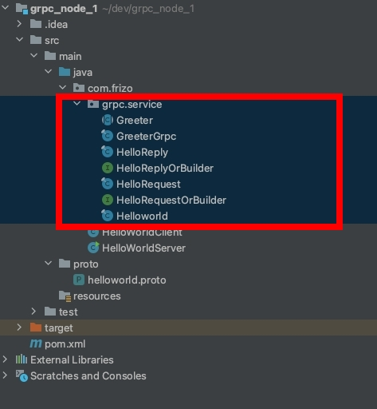

# 建構一個簡單的 java gRPC 完整範例

<br>

---

<br>
<br>

簡單建立一個 gRPC 範例， client 向 server 發送 sayHello() 問候。

<br>
<br>

----

<br>
<br>

## 1. pom.xml 設定

<br>

首先設定一下依賴：


```xml
<dependency>
    <groupId>io.grpc</groupId>
    <artifactId>grpc-netty-shaded</artifactId>
    <version>1.29.0</version>
</dependency>

<dependency>
    <groupId>io.grpc</groupId>
    <artifactId>grpc-protobuf</artifactId>
    <version>1.29.0</version>
</dependency>

<dependency>
    <groupId>io.grpc</groupId>
    <artifactId>grpc-stub</artifactId>
    <version>1.29.0</version>
</dependency>

<!-- necessary for Java 9+ -->
<!--java 低于 1.8 的版本不需要此依賴-->
<dependency>
    <groupId>org.apache.tomcat</groupId>
    <artifactId>annotations-api</artifactId>
    <version>6.0.53</version>
    <scope>provided</scope>
</dependency>
```

<br>

再來設定一下 plugin：

```xml
<build>

    <extensions>
        <!-- os-maven-plugin：此 plugin 可檢測当前系統信息-->
        <!-- ${os.detected.classifier}：這個變數可獲取作業系统的版本，如osx-x86_64-->
        <extension>
            <groupId>kr.motd.maven</groupId>
            <artifactId>os-maven-plugin</artifactId>
            <version>1.7.1</version>
        </extension>

    </extensions>


    <plugins>   

        <plugin>
            <groupId>org.xolstice.maven.plugins</groupId>
            <artifactId>protobuf-maven-plugin</artifactId>
            <version>0.6.1</version>
            <configuration>
                <protocArtifact>com.google.protobuf:protoc:3.11.0:exe:${os.detected.classifier}</protocArtifact>
                <pluginId>grpc-java</pluginId>
                <pluginArtifact>io.grpc:protoc-gen-grpc-java:1.29.0:exe:${os.detected.classifier}</pluginArtifact>
                <!--proto 原文件路徑-->
                <protoSourceRoot>${project.basedir}/src/main/proto</protoSourceRoot>
                <!--proto 編譯生成目標 java 文件路徑-->
                <outputDirectory>${project.basedir}/src/main/java</outputDirectory>
                <!--設定是否在生成 java 文件之前清空 outputDirectory 的文件，默認為 true，設定成 false 也會覆蓋同名文件-->
                <clearOutputDirectory>false</clearOutputDirectory>
            </configuration>
            <executions>
                <execution>
                    <goals>
                        <goal>compile</goal>
                        <goal>compile-custom</goal>
                    </goals>
                </execution>
            </executions>
        </plugin>

    </plugins>
</build>
```

<br>
<br>

---

<br>
<br>

## 2. 定義 proto 文件，並編譯成 java 檔案

<br>

由於我們在 pom.xml 設定了 protoSourceRoot 再 src/main/proto，所以需要在專案建立這個資料夾，並新增一個 helloworld.proto 文件。

<br>

src/main/proto/helloworld.proto：

```proto
syntax = "proto3";

option java_generic_services = true;
option java_multiple_files = true;
option java_package = "com.frizo.grpc.service";

// The greeting service definition.
service Greeter {
  // Sends a greeting
  rpc SayHello (HelloRequest) returns (HelloReply) {}
}

// The request message containing the user's name.
message HelloRequest {
  string name = 1;
}

// The response message containing the greetings
message HelloReply {
  string message = 1;
}
```

<br>
<br>

編譯 helloworld.proto 文件，如果 PC 有安裝 maven，可以直接執行：

```exec
mvn compile
```

使用 idea IDE 可以在最右側的 maven 選單選取 專案 > Lifecycle > compile。

<br>

編譯完成後，編譯結果檔案會放在 pom.xml 設定的 outputDirectory 路徑，/src/main/java 中，同時，我們定義在 helloworld.proto 文件中的 `option java_package = "com.frizo.grpc.service"` 也會建立出這個 package，並把編譯後的 java 文件生成在裡面。

<br>

以這個範例為例，最終生成文件位置：



<br>

以上，準備工作已經完成，接下來進入開發 Server 與 Client 階段。

<br>
<br>

---

<br>
<br>

## Server 與 Client

<br>

HelloWorldServer.java：

```java
package com.frizo;

import com.frizo.grpc.service.GreeterGrpc;
import com.frizo.grpc.service.HelloReply;
import com.frizo.grpc.service.HelloRequest;
import io.grpc.Server;
import io.grpc.ServerBuilder;
import io.grpc.stub.StreamObserver;

import java.io.IOException;
import java.util.concurrent.TimeUnit;

public class HelloWorldServer {

  private Server server;

  private void start() throws IOException {
    /* The port on which the server should run */
    int port = 50051;
    server = ServerBuilder.forPort(port).addService(new GreeterImpl()).build().start();
    Runtime.getRuntime()
        .addShutdownHook(
            new Thread() {
              @Override
              public void run() {
                // Use stderr here since the logger may have been reset by its JVM shutdown hook.
                System.err.println("*** shutting down gRPC server since JVM is shutting down");
                try {
                  HelloWorldServer.this.stop();
                } catch (InterruptedException e) {
                  e.printStackTrace(System.err);
                }
                System.err.println("*** server shut down");
              }
            });
  }

  private void stop() throws InterruptedException {
    if (server != null) {
      server.shutdown().awaitTermination(30, TimeUnit.SECONDS);
    }
  }

  /** Await termination on the main thread since the grpc library uses daemon threads. */
  private void blockUntilShutdown() throws InterruptedException {
    if (server != null) {
      server.awaitTermination();
    }
  }

  /** Main launches the server from the command line. */
  public static void main(String[] args) throws IOException, InterruptedException {
    final HelloWorldServer server = new HelloWorldServer();
    server.start();
    server.blockUntilShutdown();
  }

  static class GreeterImpl extends GreeterGrpc.GreeterImplBase {

    @Override
    public void sayHello(HelloRequest req, StreamObserver<HelloReply> responseObserver) {
      HelloReply reply = HelloReply.newBuilder().setMessage("Hello " + req.getName()).build();
      System.out.println("=====server=====");
      System.out.println("server: Hello " + req.getName());
      responseObserver.onNext(reply);
      responseObserver.onCompleted();
    }
  }
}
```

<br>
<br>

HelloWorldClient.java：

```java
package com.frizo;

import com.frizo.grpc.service.GreeterGrpc;
import com.frizo.grpc.service.HelloReply;
import com.frizo.grpc.service.HelloRequest;
import io.grpc.Channel;
import io.grpc.ManagedChannel;
import io.grpc.ManagedChannelBuilder;
import io.grpc.StatusRuntimeException;

import java.util.concurrent.TimeUnit;

public class HelloWorldClient {

  private final GreeterGrpc.GreeterBlockingStub blockingStub;

  /** Construct client for accessing HelloWorld server using the existing channel. */
  public HelloWorldClient(Channel channel) {
    // 'channel' here is a Channel, not a ManagedChannel, so it is not this code's responsibility to
    // shut it down.

    // Passing Channels to code makes code easier to test and makes it easier to reuse Channels.
    blockingStub = GreeterGrpc.newBlockingStub(channel);
  }

  /** Say hello to server. */
  public void greet(String name) {
    HelloRequest request = HelloRequest.newBuilder().setName(name).build();
    HelloReply response;
    try {
      response = blockingStub.sayHello(request);
    } catch (StatusRuntimeException e) {
      return;
    }
    System.out.println("Greeting: " + response.getMessage());
  }

  /**
   * Greet server. If provided, the first element of {@code args} is the name to use in the
   * greeting. The second argument is the target server.
   */
  public static void main(String[] args) throws Exception {
    String user = "hahahahah";
    // Access a service running on the local machine on port 50051
    String target = "localhost:50051";
    // Allow passing in the user and target strings as command line arguments
    if (args.length > 0) {
      if ("--help".equals(args[0])) {
        System.err.println("Usage: [name [target]]");
        System.err.println("");
        System.err.println("  name    The name you wish to be greeted by. Defaults to " + user);
        System.err.println("  target  The server to connect to. Defaults to " + target);
        System.exit(1);
      }
      user = args[0];
    }
    if (args.length > 1) {
      target = args[1];
    }

    // Create a communication channel to the server, known as a Channel. Channels are thread-safe
    // and reusable. It is common to create channels at the beginning of your application and reuse
    // them until the application shuts down.
    ManagedChannel channel =
        ManagedChannelBuilder.forTarget(target)
            // Channels are secure by default (via SSL/TLS). For the example we disable TLS to avoid
            // needing certificates.
            .usePlaintext()
            .build();
    try {
      HelloWorldClient client = new HelloWorldClient(channel);
      client.greet(user);
    } finally {
      // ManagedChannels use resources like threads and TCP connections. To prevent leaking these
      // resources the channel should be shut down when it will no longer be used. If it may be used
      // again leave it running.
      channel.shutdownNow().awaitTermination(5, TimeUnit.SECONDS);
    }
  }
}
```

<br>
<br>

先運行 Server，再運行 Client，便可以完成這個 demo。


