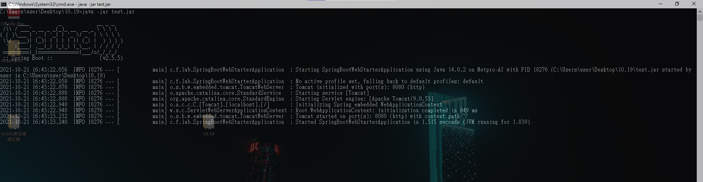

# Gradle 7 打包 Spring boot Jar 檔(使用 idea)

<br>

編輯於 2021/10/21。

使用版本資訊：

* Gradle 7.2

* JDK 1.8

* idea 2020.2

<br>

使用 idea 情況下，先要確定 Gradle 版本必須是 7 版以上才可以繼續接下來的操作。確認版本的方法如下：

<br>

### File > settings > Build, Execution, Depolyment > Build Tools > Gradle

<br>


<br>

注意圖片上化紅圈的位置，設定好 `GRADLE_HOME`。

<br>
<br>

設定好後，接下來看一下 `build.gradle` 文件：

<br>
<br>

```groovy
plugins {
    id 'org.springframework.boot' version '2.5.5'
    id 'io.spring.dependency-management' version '1.0.11.RELEASE'
    id 'java'
    id 'war'
}

group 'com.frizo.lab'
version '1.0-SNAPSHOT'
sourceCompatibility = '1.8'

bootJar {
    archiveFileName = 'test.jar'
}


configurations {
    compileOnly {
        extendsFrom annotationProcessor
    }
}


repositories {
    mavenCentral()
}

dependencies  {
    implementation 'org.springframework.boot:spring-boot-starter-web:2.5.5'
}
```

<br>

最重要的地方是 `plugins` 加入的 spring 系列工具，以及 `bootJar` 設定。

`bootJar` 的 `archiveFileName` 屬性設定打包後的 jar 檔名稱。新版的 bootJar 甚至不需要指定 MainClass，他會自動偵測具備 `public static void main(String[] args){...}` 方法的類別作為 MainClass。

<br>

一切設定好後，同步 gradle 載入設定。

<br>


<br>

同步好後，在 idea 右側的 Gradle 功能面板會看到多出來很多 Spring Boot plugins 操作。

<br>

打包完整套件依賴使用 bootJar 功能 (double click)：

<br>


<br>

build 出來的 jar 檔在這裡：

<br>


<br>

測試一下是否能正常 run：



<br>

完成。