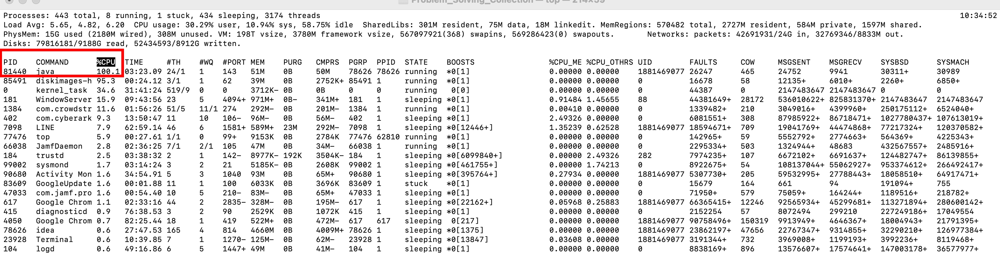
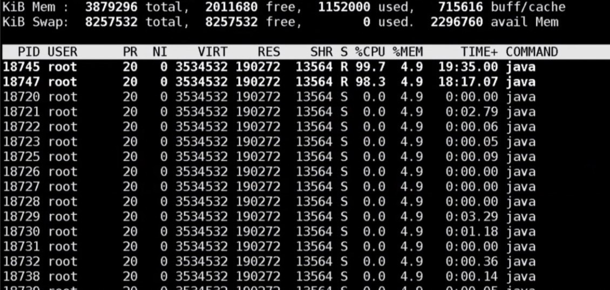
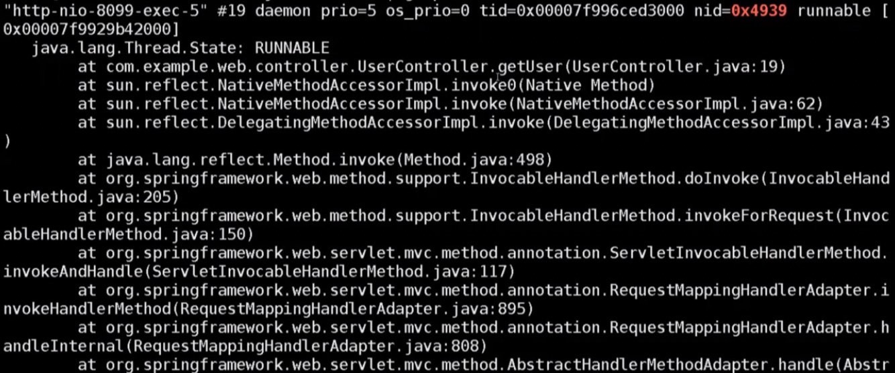

# How to Debug an Online Java Application

<br>

----

<br>

If a Java application starts and the server CPU usage increases unusually, encountering lag problems, how can you find out what's going on? Here are several steps to help you figure it out.

<br>
<br>


## setp 1. `top`

<br>

Use the `top` command to find out the Java application's __PID__ with the highest CPU usage:



You will immediately see a list of processes, among which one of the PID entries is `81440`, indicating the highest CPU usage.

<br>
<br>
<br>
<br>

## step 2. `top -H -p <PID>`

<br>

Once you have identified the PID of the process, the next step is to find out which threads are causing trouble. Use the following command:

```
top -H -p <PID>
```

<br>



<br>

You will observe that threads `18745` and `18747` are the ones we're looking for.

<br>
<br>
<br>
<br>

## step 3. `printf '0x%x\n' <PID>`

<br>

Next, we need to convert the Thread IDs (TID) to hexadecimal format. You can do this using the following command: `printf '0x%x\n' <PID>`:

For example:


```
$> printf '0x%x\n' 18745
0x4939

```


<br>
<br>
<br>
<br>


## step 4. `jstack <PID> | grep <HexTID> -A 20`

<br>
<br>

Now, use the jstack command along with grep to see details about what this thread is doing.

```
jstack <PID> | grep <HexTID> -A 20
```

For example:

```
jstack 81440 | grep 0x4939 -A 20
```

btw, `-A 20` indicates to display 20 lines of details after the matched line.



You will then see details about the thread, indicating that it is working on the UserController's get() function and is stuck at line 19.