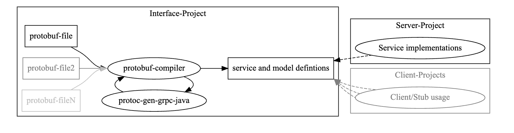
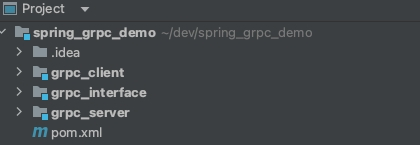
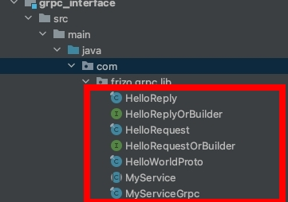
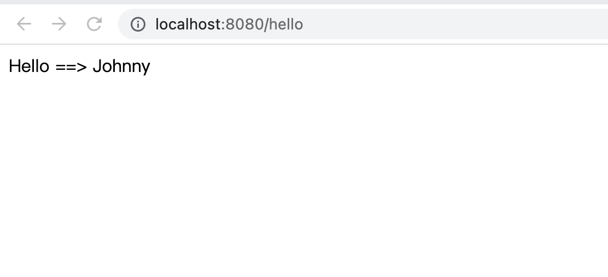

# 建構一個 Spring Boot gRPC 完整範例

<br>

---

<br>
<br>

閱讀本篇筆記之前，請先看過 [建構一個簡單的 java gRPC 完整範例](https://github.com/Johnny1110/Problem_Solving_Collection/tree/master/java/gRPC/grpc_node_1) 並嘗試過建構一個簡單 java 範例。

<br>

本篇筆記參考 Spring Boot gRPC 開源作者 Michael Zhang 的 github：https://github.com/yidongnan/grpc-spring-boot-starter/tree/master/examples

以及 Spring gRPC 官方文件：https://yidongnan.github.io/grpc-spring-boot-starter/zh-CN/server/getting-started.html

<br>
<br>

---

<br>
<br>

## 專案結構

<br>

根據 Spring Boot starter module for gRPC framework 官方文件指導，建議將專案切分成 3 個模組，像是這樣：



<br>


1. __Interface__ 項目 包含原始 protobuf 文件並生成 java model 和 service 類 (proto 編譯出的所有阿里阿咂都放這邊)。你可能會在不同的項目中會共享這個部分。

2. __Server__ 項目 包含項目的業務實現，並使用上面的 Interface 項目作為依賴項 (gRPC 服務提供者)。

3. __Client__ 項目（可選，可能有很多個 client） 任何使用預生成的 stub 來訪問服務器的客戶端項目 (gRPC 服務使用者)。

<br>
<br>

我使用 maven 的模組化來做，專案結構照官方指導：



從零建構專案時，可以先參考 spring_grpc_demo 的 [pom.xml](pom.xml)

<br>

模組資訊：

```xml
    <modules>
        <!--interface 項目 包含原始 protobuf 文件並生成 java model 和 service 類。你可能會在不同的項目中會共享這個部分-->
        <module>grpc_interface</module>
        <!--Server 項目 包含項目的業務實現，並使用上面的 Interface 項目作為依賴項-->
        <module>grpc_server</module>
        <!--Client 项目（可选，可能很多） 任何使用预生成的 stub 来访问服务器的客户端项目-->
        <module>grpc_client</module>
    </modules>
```

<br>

依賴跟 plugin 這邊就不放了，有需要可以直接到 pom.xml 裡面 copy。

<br>
<br>

---

<br>
<br>

## 建構 grpc_interface

<br>

在 grpc_interface 模組中建立 src/main/proto 資料夾，並新增 example.proto 文件：

```proto
syntax = "proto3";

package com.frizo.grpc.lib;

option java_generic_services = true;
option java_multiple_files = true;
option java_package = "com.frizo.grpc.lib";
option java_outer_classname = "HelloWorldProto";

// The greeting service definition.
service MyService {
  // Sends a greeting
  rpc SayHello (HelloRequest) returns (HelloReply) {
  }
}

// The request message containing the user's name.
message HelloRequest {
  string name = 1;
}

// The response message containing the greetings
message HelloReply {
  string message = 1;
}
```

<br>

編譯 proto 文件 (`mvn compile`) 後，結果會出現在 proto 文件設定的地方：



<br>
<br>

---

<br>
<br>

## 建構 grpc_server

<br>

### grpc_server 用到的依賴如下：

```xml
    <dependencies>
        <dependency>
            <groupId>net.devh</groupId>
            <artifactId>grpc-server-spring-boot-starter</artifactId>
        </dependency>

        <dependency>
            <groupId>com.frizo</groupId>
            <artifactId>grpc_interface</artifactId>
            <version>${project.version}</version>
        </dependency>
    </dependencies>
```

<br>
<br>

### 設定 application.yml

```yml
spring:
  application:
    name: local-grpc-server

server:
  port: 0

grpc:
  server:
    port: 9898
```

<br>
<br>

### 建構 config 設定檔：

<br>

com.frizo.grpc.config.LogGrpcInterceptor.java

```java
import io.grpc.Metadata;
import io.grpc.ServerCall;
import io.grpc.ServerCallHandler;
import io.grpc.ServerInterceptor;
import org.slf4j.Logger;
import org.slf4j.LoggerFactory;

public class LogGrpcInterceptor implements ServerInterceptor {
    private static final Logger log = LoggerFactory.getLogger(LogGrpcInterceptor.class);

    @Override
    public <ReqT, RespT> ServerCall.Listener<ReqT> interceptCall(ServerCall<ReqT, RespT> serverCall, Metadata metadata, ServerCallHandler<ReqT, RespT> serverCallHandler) {
        log.info(serverCall.getMethodDescriptor().getFullMethodName());
        return serverCallHandler.startCall(serverCall, metadata);
    }
}
```

<br>

com.frizo.grpc.config.GlobalInterceptorConfiguration.java

```java
import net.devh.boot.grpc.server.interceptor.GrpcGlobalServerInterceptor;
import org.springframework.context.annotation.Configuration;

@Configuration(proxyBeanMethods = false)
public class GlobalInterceptorConfiguration {

    @GrpcGlobalServerInterceptor
    LogGrpcInterceptor logServerInterceptor() {
        return new LogGrpcInterceptor();
    }

}
```

<br>
<br>

### 建立服務

com.frizo.grpc.service.GrpcServerService.java

```java
import com.frizo.grpc.lib.HelloReply;
import com.frizo.grpc.lib.HelloRequest;
import com.frizo.grpc.lib.MyServiceGrpc;
import io.grpc.stub.StreamObserver;
import net.devh.boot.grpc.server.service.GrpcService;

@GrpcService
public class GrpcServerService extends MyServiceGrpc.MyServiceImplBase {
    @Override
    public void sayHello(HelloRequest request, StreamObserver<HelloReply> responseObserver) {
        HelloReply reply = HelloReply.newBuilder()
                .setMessage("Hello ==> " + request.getName())
                .build();
        responseObserver.onNext(reply);
        responseObserver.onCompleted();
    }
}
```

<br>
<br>

### 建構 Spring Boot Application

<br>

com.frizo.grpc.LocalGrpcServerApplication.java

```java
import org.springframework.boot.SpringApplication;
import org.springframework.boot.autoconfigure.SpringBootApplication;

@SpringBootApplication
public class LocalGrpcServerApplication {
    public static void main(String[] args) {
        SpringApplication.run(LocalGrpcServerApplication.class, args);
    }
}
```

<br>
<br>

---

<br>
<br>

## 建構 grpc_client

<br>

### grpc_client 用到的依賴如下：

```xml
    <dependencies>
        <dependency>
            <groupId>net.devh</groupId>
            <artifactId>grpc-client-spring-boot-starter</artifactId>
        </dependency>

        <dependency>
            <groupId>com.frizo</groupId>
            <artifactId>grpc_interface</artifactId>
            <version>${project.version}</version>
        </dependency>

        <dependency>
            <groupId>org.springframework.boot</groupId>
            <artifactId>spring-boot-starter-web</artifactId>
        </dependency>

    </dependencies>
```

<br>
<br>

### 設定 application.yml

```yml
server:
  port: 8080
spring:
  application:
    name: local-grpc-client

grpc:
  client:
    local-grpc-server: # grpc_server 服務的 domain 資訊
      address: 'static://127.0.0.1:9898'
      enableKeepAlive: true
      keepAliveWithoutCalls: true
      negotiationType: plaintext
```

<br>
<br>

### 建構 config 設定檔：

<br>

com.frizo.grpc.config.LogGrpcInterceptor.java

```java

import org.slf4j.Logger;
import org.slf4j.LoggerFactory;

import io.grpc.CallOptions;
import io.grpc.Channel;
import io.grpc.ClientCall;
import io.grpc.ClientInterceptor;
import io.grpc.ForwardingClientCall;
import io.grpc.ForwardingClientCallListener;
import io.grpc.Metadata;
import io.grpc.MethodDescriptor;
import io.grpc.Status;

public class LogGrpcInterceptor implements ClientInterceptor {

    private static final Logger log = LoggerFactory.getLogger(LogGrpcInterceptor.class);

    @Override
    public <ReqT, RespT> ClientCall<ReqT, RespT> interceptCall(
            MethodDescriptor<ReqT, RespT> method,
            CallOptions callOptions,
            Channel next) {

        log.info("Received call to {}", method.getFullMethodName());
        return new ForwardingClientCall.SimpleForwardingClientCall<ReqT, RespT>(next.newCall(method, callOptions)) {

            @Override
            public void sendMessage(ReqT message) {
                log.debug("Request message: {}", message);
                super.sendMessage(message);
            }

            @Override
            public void start(Listener<RespT> responseListener, Metadata headers) {
                super.start(
                        new ForwardingClientCallListener.SimpleForwardingClientCallListener<RespT>(responseListener) {
                            @Override
                            public void onMessage(RespT message) {
                                log.debug("Response message: {}", message);
                                super.onMessage(message);
                            }

                            @Override
                            public void onHeaders(Metadata headers) {
                                log.debug("gRPC headers: {}", headers);
                                super.onHeaders(headers);
                            }

                            @Override
                            public void onClose(Status status, Metadata trailers) {
                                log.info("Interaction ends with status: {}", status);
                                log.info("Trailers: {}", trailers);
                                super.onClose(status, trailers);
                            }
                        }, headers);
            }
        };
    }

}
```

<br>

com.frizo.grpc.config.GlobalClientInterceptorConfiguration.java

```java
import net.devh.boot.grpc.client.interceptor.GrpcGlobalClientInterceptor;
import org.springframework.context.annotation.Configuration;
import org.springframework.core.Ordered;
import org.springframework.core.annotation.Order;

@Order(Ordered.LOWEST_PRECEDENCE)
@Configuration(proxyBeanMethods = false)
public class GlobalClientInterceptorConfiguration {

    @GrpcGlobalClientInterceptor
    LogGrpcInterceptor logClientInterceptor() {
        return new LogGrpcInterceptor();
    }

}
```

<br>

com.frizo.grpc.config.GrpcConfig.java (可能多少因為這是非 Spring 官方維運的專案，所以版本上會有衝突問題，需要多加這個 config 才能在我用的版本正常運行。)

```java
import org.springframework.boot.autoconfigure.ImportAutoConfiguration;
import org.springframework.context.annotation.Configuration;

@Configuration
@ImportAutoConfiguration({
        net.devh.boot.grpc.client.autoconfigure.GrpcClientAutoConfiguration.class,
        net.devh.boot.grpc.client.autoconfigure.GrpcClientMetricAutoConfiguration.class,
        net.devh.boot.grpc.client.autoconfigure.GrpcClientHealthAutoConfiguration.class,
        net.devh.boot.grpc.client.autoconfigure.GrpcClientSecurityAutoConfiguration.class,
        net.devh.boot.grpc.client.autoconfigure.GrpcClientTraceAutoConfiguration.class,
        net.devh.boot.grpc.client.autoconfigure.GrpcDiscoveryClientAutoConfiguration.class,

        net.devh.boot.grpc.common.autoconfigure.GrpcCommonCodecAutoConfiguration.class,
        net.devh.boot.grpc.common.autoconfigure.GrpcCommonTraceAutoConfiguration.class
})
public class GrpcConfig {
}
```


<br>
<br>

### 建立服務

com.frizo.grpc.service.GrpcClientService.java

```java
import com.frizo.grpc.lib.HelloReply;
import com.frizo.grpc.lib.HelloRequest;
import com.frizo.grpc.lib.MyServiceGrpc.MyServiceBlockingStub;

import io.grpc.StatusRuntimeException;
import net.devh.boot.grpc.client.inject.GrpcClient;
import org.springframework.stereotype.Service;

@Service
public class GrpcClientService {
    @GrpcClient("local-grpc-server") // 這個要跟 yml 設的 grpc 服務名稱一樣
    private MyServiceBlockingStub myServiceStub;

    public String sendMessage(final String name) {
        try {
            final HelloReply response = this.myServiceStub.sayHello(HelloRequest.newBuilder().setName(name).build());
            return response.getMessage();
        } catch (final StatusRuntimeException e) {
            return "FAILED with " + e.getStatus().getCode().name();
        }
    }
}
```

<br>
<br>

### 建構 controller

<br>

com.frizo.grpc.controller.GrpcClientController.java

```java
import com.frizo.grpc.service.GrpcClientService;
import org.springframework.beans.factory.annotation.Autowired;
import org.springframework.web.bind.annotation.GetMapping;
import org.springframework.web.bind.annotation.RequestParam;
import org.springframework.web.bind.annotation.RestController;

@RestController
public class GrpcClientController {
    @Autowired
    private GrpcClientService grpcClientService;

    @GetMapping("/hello")
    public String printMessage(@RequestParam(defaultValue = "Johnny") String name) {
        return grpcClientService.sendMessage(name);
    }
}
```

<br>
<br>

### 建構 Spring Boot Application

<br>

com.frizo.grpc.LocalGrpcClientApplication.java

```java
import org.springframework.boot.SpringApplication;
import org.springframework.boot.autoconfigure.SpringBootApplication;

@SpringBootApplication
public class LocalGrpcClientApplication {

    public static void main(String[] args) {
        SpringApplication.run(LocalGrpcClientApplication.class, args);
    }

}
```

<br>
<br>

---

<br>
<br>

分別啟動 server 與 client 模組，訪問 http://localhost:8080/hello 測試看看。

<br>


