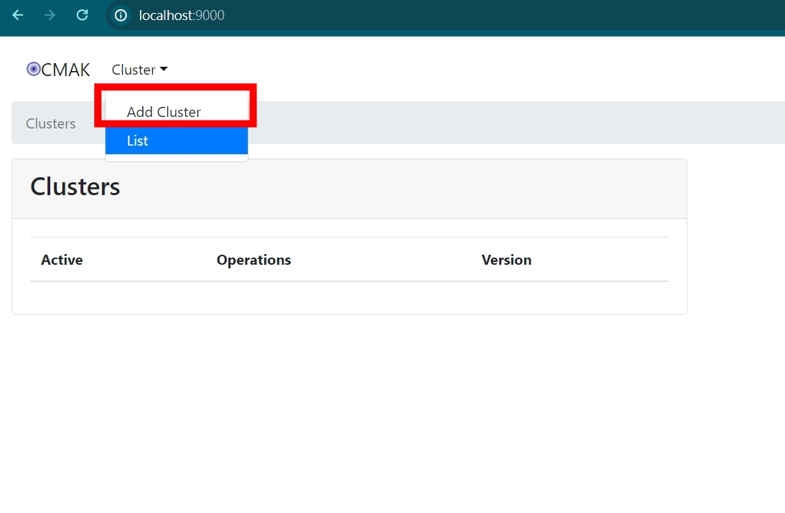
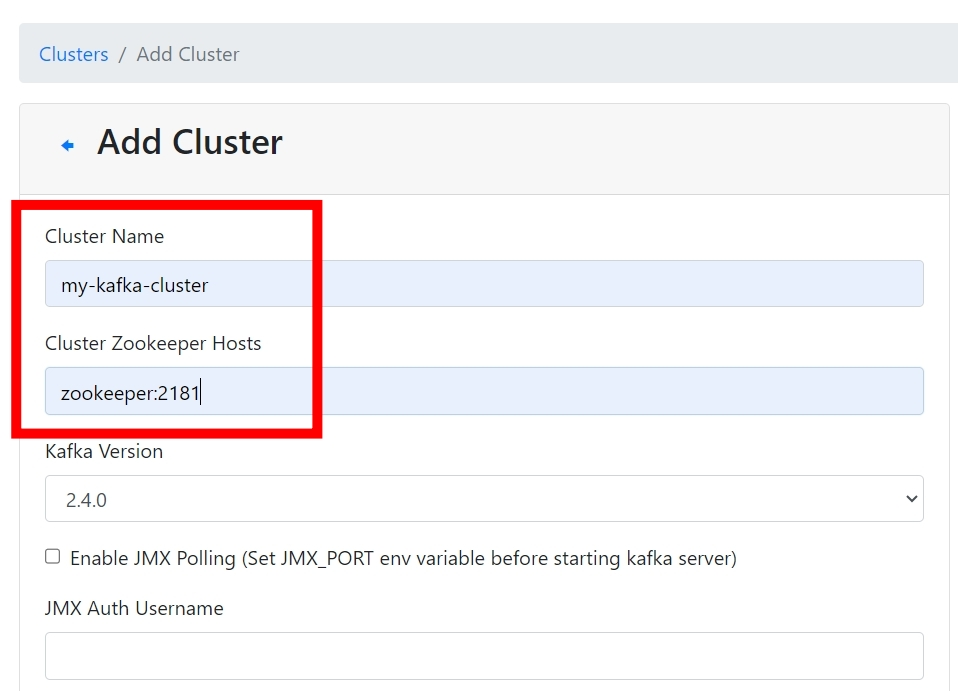
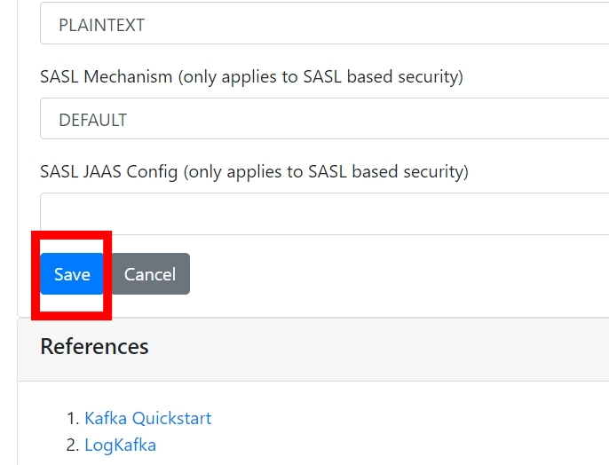
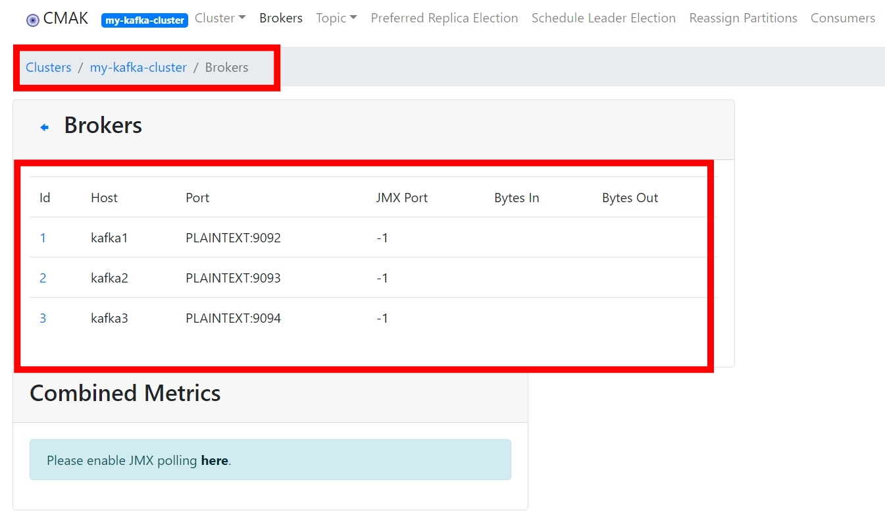
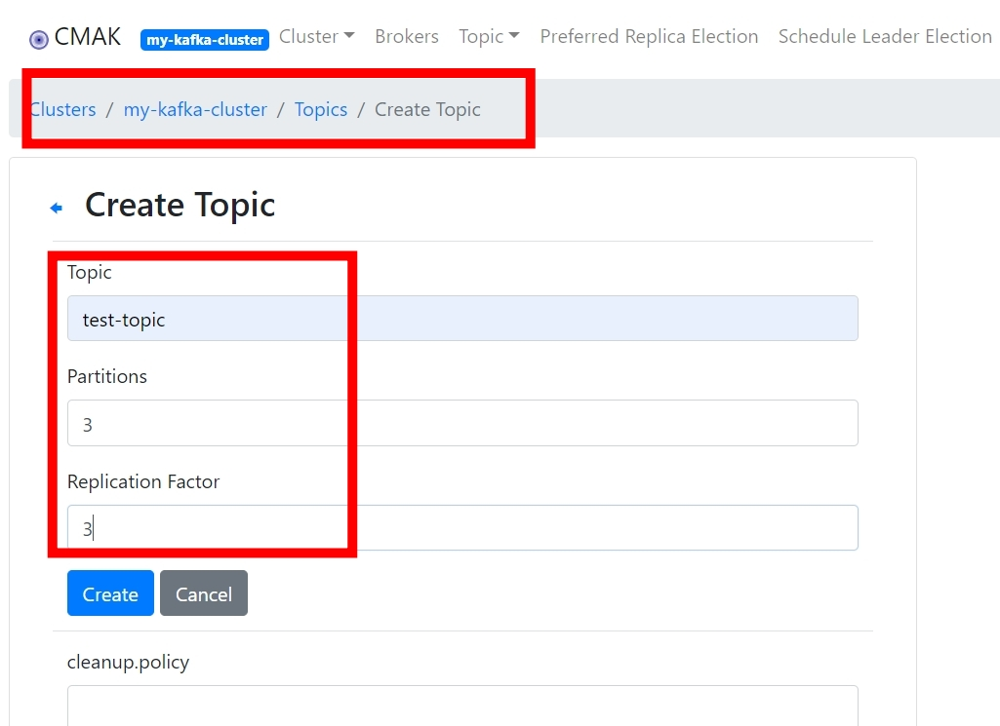
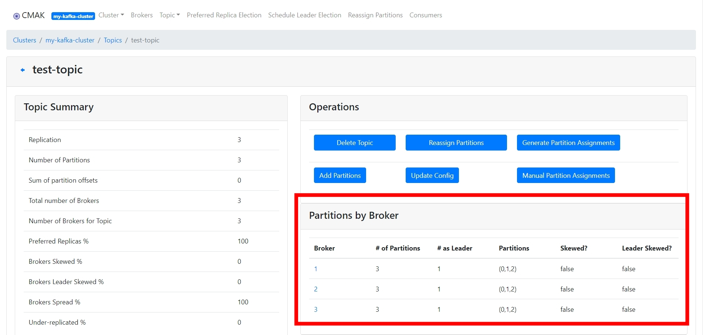
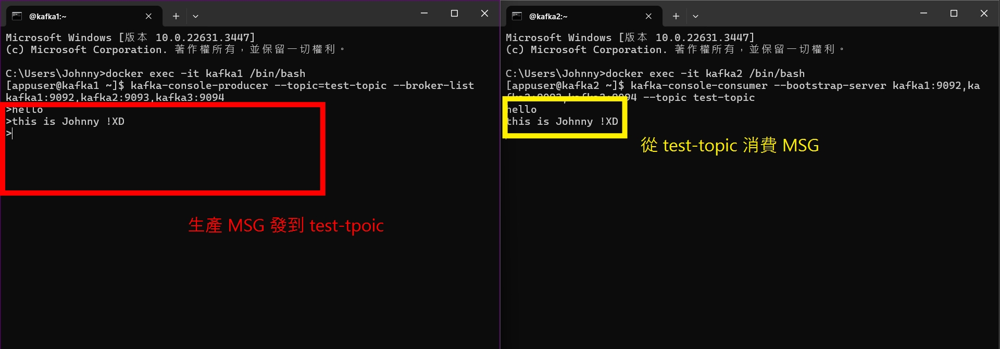

# Kafka Docker Cluster 部屬

<br>

---

<br>

本篇筆記紀錄一下如何用 docker 建置 Kafka Cluster。

<br>


## docker-compose.yml

<br>

建立一個 docker-compose.yml 內容如下:

```yml
version: '3'

services:

  zookeeper:
    container_name: zookeeper
    hostname: zookeeper
    image: confluentinc/cp-zookeeper:7.0.1
    environment:
      ZOOKEEPER_CLIENT_PORT: 2181
      ZOOKEEPER_TICK_TIME: 2000
    ports:
      - "2181:2181"
    networks:
      - kafka-net

  kafka1:
    container_name: kafka1
    hostname: kafka1
    image: confluentinc/cp-kafka:7.0.1
    depends_on:
      - zookeeper
    ports:
      - "9092:9092"
    environment:
      KAFKA_BROKER_ID: 1
      KAFKA_ZOOKEEPER_CONNECT: zookeeper:2181
      KAFKA_LISTENER_SECURITY_PROTOCOL_MAP: PLAINTEXT:PLAINTEXT
      KAFKA_ADVERTISED_LISTENERS: PLAINTEXT://kafka1:9092
      KAFKA_LISTENERS: PLAINTEXT://0.0.0.0:9092
      KAFKA_OFFSETS_TOPIC_REPLICATION_FACTOR: 3
      KAFKA_TRANSACTION_STATE_LOG_MIN_ISR: 2
      KAFKA_TRANSACTION_STATE_LOG_REPLICATION_FACTOR: 3
      KAFKA_LOG_RETENTION_HOURS: 168
      KAFKA_AUTO_CREATE_TOPICS_ENABLE: "true"
    networks:
      - kafka-net

  kafka2:
    container_name: kafka2
    hostname: kafka2
    image: confluentinc/cp-kafka:7.0.1
    depends_on:
      - zookeeper
    ports:
      - "9093:9093"
    environment:
      KAFKA_BROKER_ID: 2
      KAFKA_ZOOKEEPER_CONNECT: zookeeper:2181
      KAFKA_LISTENER_SECURITY_PROTOCOL_MAP: PLAINTEXT:PLAINTEXT
      KAFKA_ADVERTISED_LISTENERS: PLAINTEXT://kafka2:9093
      KAFKA_LISTENERS: PLAINTEXT://0.0.0.0:9093
      KAFKA_OFFSETS_TOPIC_REPLICATION_FACTOR: 3
      KAFKA_TRANSACTION_STATE_LOG_MIN_ISR: 2
      KAFKA_TRANSACTION_STATE_LOG_REPLICATION_FACTOR: 3
      KAFKA_LOG_RETENTION_HOURS: 168
      KAFKA_AUTO_CREATE_TOPICS_ENABLE: "true"
    networks:
      - kafka-net

  kafka3:
    container_name: kafka3
    hostname: kafka3
    image: confluentinc/cp-kafka:7.0.1
    depends_on:
      - zookeeper
    ports:
      - "9094:9094"
    environment:
      KAFKA_BROKER_ID: 3
      KAFKA_ZOOKEEPER_CONNECT: zookeeper:2181
      KAFKA_LISTENER_SECURITY_PROTOCOL_MAP: PLAINTEXT:PLAINTEXT
      KAFKA_ADVERTISED_LISTENERS: PLAINTEXT://kafka3:9094
      KAFKA_LISTENERS: PLAINTEXT://0.0.0.0:9094
      KAFKA_OFFSETS_TOPIC_REPLICATION_FACTOR: 3
      KAFKA_TRANSACTION_STATE_LOG_MIN_ISR: 2
      KAFKA_TRANSACTION_STATE_LOG_REPLICATION_FACTOR: 3
      KAFKA_LOG_RETENTION_HOURS: 168
      KAFKA_AUTO_CREATE_TOPICS_ENABLE: "true"
    networks:
      - kafka-net

  kafka-manager:
    container_name: kafka-manager
    hostname: kafka-manager
    image: hlebalbau/kafka-manager:latest
    depends_on:
      - zookeeper
      - kafka1
      - kafka2
      - kafka3
    ports:
      - "9000:9000"
    environment:
      ZK_HOSTS: zookeeper:2181
    networks:
      - kafka-net

networks:
  kafka-net:
    driver: bridge
```

<br>

建置完成後在 yml 文件路徑下執行 `docker-compose` 指令:

```bash
docker-compose up -d
```

<br>

在瀏覽器上開啟 kafka manager: http://localhost:9000

<br>

新增 Cluster: 



<br>

輸入 cluster name 和 zookeeper DOMAIN & port: 



<br>

保存:



<br>

檢視 Brokers:



<br>

建立 Topic:




<br>

檢視 Topic:



<br>
<br>
<br>
<br>

## 建立測試生產者

```bash
docker exec -it kafka1 /bin/bash

kafka-console-producer --topic=test-topic --broker-list kafka1:9092,kafka2:9093,kafka3:9094
```

<br>
<br>
<br>
<br>

## 建立測試消費者

```bash
docker exec -it kafka2 /bin/bash

kafka-console-consumer --bootstrap-server kafka1:9092,kafka2:9093,kafka3:9094 --from-beginning --topic test-topic
```

<br>
<br>
<br>
<br>

## 實際測試結果

<br>




