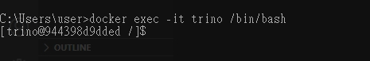
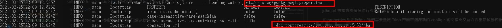
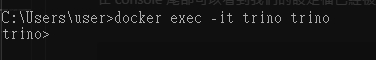
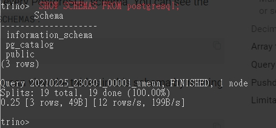
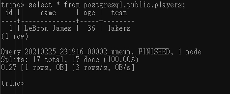

# Trino 入門

<br>

---

<br>

Trino 的前身是 Presto，是由 Facebook 公司的團隊開發的一款分散式 SQL 查詢引擎。本來開發理念是以 open source 的形式發表，後來 Facebook 決定推翻這一個政策，團隊內的某些開發人員意見出現分歧，所以一部分人出走另外做了一個 Trino （可以說是 Presto 的 open source 版本）。之後或許就這樣直接分家發展成 2 個不同產品了。

<br>

為了方便，我使用 docker 來演示 Trino 查詢 postgres。開始前請安裝好 Docker。我在 GCP 上架設了一個 postgres 伺服器作為演示。

<br>

首先把 trino 鏡像 pull 到本地端：

<br>

```bash
docker pull trinodb/trino
```

<br>

接下來就把 Trino 運行起來：

<br>

```bash
docker run -p 8080:8080 --name trino trinodb/trino
```

<br>

Trino 容器成功啟動後，我們使用 `exec` 進入容器內做一些設定：

<br>

```bash
docker exec -it trino /bin/bash
```

<br>



<br>

接下來要設定 connection，記住以下這個路徑，所有 Trino 的 Connection 設定檔都在這邊：

<br>

```
/data/trino/etc/catalog
```

<br>

我們要建立一個 postgresql 的 Connection，所以需要先建立一個 postgresql.properties 的文件：

<br>

```bash
touch postgresql.properties
```

<br>

接下來需要編輯這個文件做一些設定，具體設定方式可參照官方給出的 demo 範例，不只有 postgres 的設定，還有其他種類 data source 的設定細節：

<br>

[Trino Connectors](https://trino.io/docs/current/connector.html)

<br>

在 postgresql.properties 文件內編輯以下內容：

<br>

```properties
connector.name=postgresql
connection-url=jdbc:postgresql://xxx.xxx.xxx.xxx:5432/nba
connection-user=root
connection-password=password
```

<br>

jdbc-url 根據實際情況進行設定就好了。

在 properties 設定好後，我們需要重啟 Trino 容器來適應新的 config。關閉指令交互介面重新啟動容器：

<br>

```bash
docker restart trino
```

<br>

為了演示細節，我這邊先 `stop` 容器然後重新 `start -a` 容器，使用 `-a` 參數是要看一些啟動細節：


<br>

```bash
docker stop trino
```

```bash
docker start trino -a
```

<br>



<br>

在 console 尾部可以看到我們的設定檔已經被 Trino 成功載入了。接下來就可以進入 Trino 交互介面操作看看了：

<br>

```bash
docker exec -it trino trino
```

<br>



<br>

先看一下 postgresql 的 schema

<br>

```sql
SHOW SCHEMAS FROM postgresql;
```



<br>

接下來查詢 players 資料表看看：

<br>

```sql
select * from postgresql.public.players;
```



<br>

至此，我們已經成功建立起 Trino 與 postgresql 的連線。